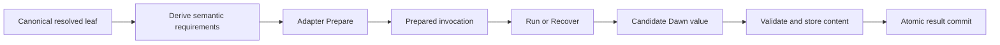

# Agent Adapter Capability Boundary

**Issue:** GitHub #9, “Define agent roles and the adapter capability boundary”

**Depends on:** GitHub #5 through #8 and their approved specifications

**Status:** Design approved on 2026-08-09

**Goal:** Define one provider-independent boundary through which Dawn can prepare, run, recover, validate, and commit raw-model and tool-using-agent leaves without teaching the workflow core about provider models, tools, MCP servers, permissions, files, sessions, or command-line flags.

## Product Principle

Dawn owns workflow meaning. An adapter owns the difficult translation between that meaning and one provider or agent runtime.

The boundary should make a broad range of adapters possible while adding no provider machinery to the workflow language. A direct multimodal API, a local Codex or Claude Code process, a remote workspace agent, and a test fake should all fit behind the same semantic contract. They do not have to pretend to support the same operations.

This design is a clean redesign. It has no compatibility obligation to the current `Backend`, plan format, or AWF adapter interfaces.

## Decisions

- Use one deep adapter interface for both `llm` and `agent` leaves.
- Preserve `llm` and `agent` as distinct tagged invocation surfaces.
- Give the interface three semantic operations: prepare, run, and recover.
- Resolve every alias, reusable agent declaration, default, and node override before the adapter boundary.
- Add no `roles:`, `models:`, capability, recovery, or provider-session syntax in this ticket.
- Treat a named agent as a possible source-level route to one resolved adapter binding, not as a durable conversational actor.
- Keep adapter configuration opaque to Dawn core and make the adapter its sole interpreter and validator.
- Derive semantic requirements from leaf kind, contracts, inputs, and workspace declarations. Authors never list capabilities.
- Evaluate capabilities against the concrete prepared request rather than through a growing struct of provider-feature booleans.
- Return one candidate Dawn value, not parallel text, JSON, file, and artifact result channels.
- Keep structured values, files, and trees uncommitted until Dawn validates and stores the complete candidate atomically.
- Make exact-operation recovery optional and automatic. It is not a workflow requirement or knob.
- Keep provider recovery handles operational, opaque, and confined to one logical leaf invocation.
- Use the narrow retry definition already approved in #8: same-session continuation only after a positively recognized transient upstream provider failure.
- Make cancellation part of the adapter/backend contract rather than an optional capability or workflow setting.
- Use a small typed error surface and expose no generic `retryable` category.
- Defer all author-facing spelling to #12.

## What This Ticket Does Not Add

This design deliberately adds none of the following:

- a `roles:` or `models:` section;
- a second registry for LLMs;
- author-written `requires:` capability lists;
- native-feature flags such as `native_schema`;
- a common schema for models, reasoning effort, tools, MCP, permissions, or sessions;
- session continuation between nodes;
- workflow retry counts, backoff settings, or retry predicates;
- PDF, image, browser, Docker, or skill node kinds;
- separate text, JSON, attachment, workspace, and artifact result APIs;
- provider file IDs as durable values;
- optional marker interfaces for each new adapter feature; or
- adapter-defined control flow.

These cuts are structural. They concentrate provider complexity inside one deep module instead of removing product capability.

## Alternatives Considered

### 1. AWF-shaped adapter seam

AWF uses static capability fields, opaque `with:` maps, optional extension interfaces, role-bound adapter wrappers, streaming event and outcome channels, and provider-specific live-session machinery. It proves the value of opaque provider configuration and a registry, but its capabilities and lifecycle concerns have grown across the engine.

Copying this shape would give Dawn immediate precedents for many features. It would also reproduce configuration layering, optional-interface discovery, provider-session guards, retry policies, and event-channel coupling in the core. The interface would become a map of AWF history rather than a Dawn semantic boundary.

### 2. Separate LLM and agent interfaces

Dawn could define `LLMAdapter` and `AgentAdapter` independently. Their type-specific entry points would be explicit, but preparation, configuration, versioning, cancellation, recovery, diagnostics, candidate handling, and errors would be duplicated. An implementation serving both surfaces would need two registrations or a wrapper layer.

This is semantically tidy but shallow. The two leaves differ in payload delivery, not in lifecycle or commit semantics.

### 3. Prepared semantic adapter — chosen

One adapter prepares a tagged `llm` or `agent` request, then runs or recovers it through one lifecycle and result protocol. The tag preserves the leaf distinction while the deep interface hides provider mechanics.

This design covers every current requirement with three operations and one candidate boundary. Adding a provider changes an adapter package, not the compiler, scheduler, ledger, or value model.

## Domain Vocabulary

### Resolved leaf

A **resolved leaf** is a canonical `llm` or `agent` node whose bindings and inputs are concrete enough to prepare. It contains:

- leaf kind;
- task and effective instructions;
- typed input values or their immutable references;
- attachment or workspace delivery intent;
- exact output contract; and
- one resolved adapter binding.

The leaf is provider-independent. Its task, instructions, contracts, values, and file semantics contribute to the effective-work fingerprint under #8.

### Resolved adapter binding

A **resolved adapter binding** contains:

- adapter identity;
- one opaque effective configuration value;
- optional reusable instructions already combined into the leaf; and
- source provenance for diagnostics.

It is an internal compilation result, not a new durable runtime actor. The adapter receives one configuration layer. It never sees role defaults, node overrides, aliases, templates, or unresolved references.

The author format may later offer a concise direct binding, a reusable named binding, both, or another spelling. #12 owns that decision. Whatever spelling is chosen must compile to this same object.

### Semantic requirements

**Semantic requirements** describe what must be true for one resolved leaf to preserve its declared meaning. They are derived automatically from the canonical leaf:

- execution surface: raw `llm` or workspace `agent`;
- exact output contract;
- raw attachment media types and fidelity;
- workspace inputs that must materialize; and
- workspace files or trees that must be captured.

These requirements are internal typed data, not user-facing capability names.

### Prepared invocation

A **prepared invocation** is ephemeral adapter-owned execution state created after one concrete request passes adapter validation and capability negotiation. It is safe to hand to `Run` or, when reconstructing after interruption, to `Recover`.

It is not journaled. Dawn can recreate it from the captured workflow, immutable inputs, resolved binding, and runtime environment.

### Candidate result

A **candidate result** is one complete value proposed by an adapter. It may contain any value kind in #6's type algebra, including files and trees. It is not visible to downstream nodes until Dawn validates, stores, and commits it.

### Recovery handle

A **recovery handle** is an opaque adapter-owned reference to one already-submitted provider operation. It can be checkpointed and later returned to that adapter's `Recover` operation for the same logical leaf invocation.

A recovery handle is not a result, workflow value, conversational memory, or portable provider identifier.

## Architecture and Ownership



| Owner | Owns | Does not own |
| --- | --- | --- |
| Compiler | Canonical leaf meaning, binding resolution, instruction composition, requirement derivation | Provider configuration meaning, provider feature flags, sessions |
| Adapter | Opaque configuration, provider translation, provider-specific preflight, exact-operation recovery, same-session transient continuation, diagnostics | Workflow syntax, control flow, commits, cross-node state |
| Execution backend | Concrete workspace/process environment and force-stop mechanism | Workflow graph semantics, provider API configuration |
| Scheduler | Readiness, runtime capacity, cancellation propagation, leaf dispatch | Provider error parsing, provider session protocols |
| Run ledger | Attempts, effect keys, recovery checkpoints, cancellation facts, terminal outcomes, commits | Provider handle format, uploads, commands |
| Value store | Canonical values, immutable file/tree content, digests, reachability | Provider file IDs, workspace liveness, invocation history |

The adapter and execution backend may collaborate to satisfy workspace and cancellation semantics. Their internal boundary is an implementation detail. The workflow core observes only the prepared semantic promise.

## The Universal Adapter Contract

The conceptual contract has three operations:

```text
Prepare(resolved request)
    -> prepared invocation + behavior provenance
    | unsupported
    | invalid configuration

Run(prepared invocation, concrete inputs, execution context, sinks)
    -> candidate success
    | failed
    | cancelled

Recover(prepared invocation, recovery handle, execution context, sinks)
    -> candidate success
    | failed
    | cancelled
```

Exact Go types, generics, allocation strategy, and asynchronous implementation belong to implementation planning. The semantic contract does not require event channels, goroutines, callbacks, or a particular transport.

### `Prepare`

`Prepare` is the adapter's one authoritative configuration and capability boundary. It receives:

- adapter identity and opaque resolved configuration;
- `llm` or `agent` surface;
- task and effective instructions;
- typed input descriptions;
- attachment media/fidelity requirements;
- workspace materialization and capture requirements;
- exact output contract; and
- execution-backend facts needed to determine delivery support.

It returns:

- ephemeral adapter-owned prepared state;
- resolved adapter and provider/runtime version information;
- a stable non-secret effective-behavior signature; and
- confirmation that the exact semantic request can be satisfied.

Preparation must not submit the leaf task, upload task inputs, create a provider operation, mutate the workspace, or spend model tokens. Version discovery and read-only provider/runtime inspection are allowed. Any operation that can create task work belongs after the ledger records an attempt start.

Preparation applies provider defaults and resolves configuration aliases before calculating behavior provenance. Two raw configurations that result in identical effective behavior may produce the same signature. A changed model, tool policy, system behavior, or other result-relevant provider setting must change it.

Secret bytes never enter prepared provenance, a fingerprint, error details, or the journal. If credential choice must be semantic, the workflow must carry a non-secret declared selector or version value, as established in #8.

### `Run`

`Run` receives:

- the prepared invocation;
- immutable concrete input values;
- the logical effect key from #8;
- a cancellation context;
- a runtime-owned candidate sink;
- a runtime-owned recovery-checkpoint sink; and
- a runtime-owned diagnostic sink.

The adapter may translate structured inputs, upload attachments, create a local or remote workspace, invoke a CLI or API, use provider tools, and download or capture results. These actions happen inside the recorded attempt.

The adapter must not mutate committed input values. A local workspace is a private materialization; a remote workspace is transient adapter/backend state. Anything intended to cross a node boundary must enter the candidate sink.

### `Recover`

`Recover` receives a newly recreated prepared invocation plus a checkpointed opaque recovery handle. It may:

- poll or retrieve the referenced operation;
- attach to the referenced live execution;
- continue that same operation where the provider requires continuation; and
- cancel that operation when cancellation is requested.

It may not submit the original task again, create a replacement provider session, or reinterpret a general chat transcript as the interrupted operation. If exact recovery is impossible, it returns failure. The run ledger then applies #8's continuation semantics; another uncommitted invocation, if started, is a new attempt and is not `Recover`.

### Runtime-owned sinks

The interface uses three semantic sinks so ownership remains clear. An implementation may realize them without literal sink objects.

#### Candidate sink

The candidate sink accepts the one contracted output value and the bytes or streams backing any file/tree values. It writes only into uncommitted Dawn-owned storage.

The adapter reports candidate success only after every declared candidate component has finished. A provider file ID, URL, path, or container reference is insufficient until the promised content has entered Dawn-owned candidate storage.

#### Recovery-checkpoint sink

The checkpoint sink records a new or updated opaque handle against the active attempt. Its acknowledgement means the handle is durable. The adapter must wait for acknowledgement before assuming the runtime can recover through it.

This blocking durability handshake minimizes the crash window after a provider returns an operation reference. If the process dies after provider submission but before any handle is durably acknowledged, the ledger sees an interrupted attempt without recoverable state. #8 then permits a later explicit continuation to begin the uncommitted node again as a new attempt.

The logical effect key is supplied automatically for providers that support idempotent submission. It does not convert an uncheckpointed operation into recoverable state.

#### Diagnostic sink

The diagnostic sink accepts progress, logs, usage, tool activity, provider error details, and other observations. These observations are not bindable values, control-flow events, or semantic journal facts.

This ticket does not standardize a provider-neutral transcript or tool-event ontology. A later observability design may normalize selected measurements without changing the adapter result contract.

## Tagged Invocation Surfaces

One adapter interface does not collapse the difference between `llm` and `agent`.

### Common invocation data

Both surfaces receive:

- task;
- effective instructions;
- typed structured inputs;
- exact output contract;
- immutable definition/input provenance;
- effect key;
- cancellation; and
- candidate, checkpoint, and diagnostic sinks.

Task and instructions are semantic concepts, not provider message-role requirements. An adapter may map them to a system message, developer message, CLI system prompt, combined prompt, or another provider-native form as long as the behavior remains faithful.

### Raw `llm`

A raw `llm` invocation has no workspace. File values arrive as named raw attachments with media and fidelity requirements.

The adapter may use base64, an upload API, a provider file ID, a URL, multipart content, or another provider mechanism internally. It must preserve the required semantics. For example, visual PDF analysis cannot silently become text extraction.

The same invocation may accept one file, many files, or no files. Multimodality belongs to the selected adapter/model behavior, not to a special Dawn node kind.

### Workspace `agent`

An `agent` invocation receives a private workspace manifest. The execution backend and adapter materialize the optional base tree and immutable named file/tree inputs at Dawn-derived paths, then capture declared outputs before candidate success.

The agent may be multimodal and read PDFs, images, or any other files from that workspace. Passing a file to an agent means making its immutable content available at the manifest path and telling the agent where it is; it does not imply a provider attachment channel or a new filesystem isolation boundary.

Skills are ordinary instructions and staged files/trees. If an adapter supports a provider-native skill mechanism, it may expose that through opaque adapter configuration. Dawn core has no `/skill` protocol.

## Capability Negotiation

Capability negotiation answers whether the prepared adapter/backend combination can preserve one concrete leaf's semantics. It does not publish a catalog of native provider features.

| Derived question | Honest match |
| --- | --- |
| Execution surface | The adapter implements the requested `llm` or `agent` semantics. |
| Output contract | The adapter can produce a candidate for this exact contract or a typed terminal failure. |
| Raw attachments | Every attachment media type can be delivered at the required text or visual fidelity. |
| Workspace materialization | The concrete file/tree inputs can be placed into the private agent workspace and represented in its manifest. |
| Workspace capture | The declared file/tree outputs can be retrieved into Dawn-owned candidate storage before success. |
| Exact-operation recovery | When the provider supplies a suitable operation reference, the adapter can checkpoint, retrieve/attach/continue, and cancel that exact operation. This is optional operational support, not an admission requirement. |

These are predicates over a request, not Boolean claims on an adapter type.

### Structured output

A non-string output contract does not require a provider's native structured-output feature. It requires the adapter to return a candidate value that Dawn can validate against the exact canonical contract.

An adapter may use native constrained decoding, a CLI schema flag, strict response parsing, an internal extraction stage, or another faithful implementation. Provider schema subsets and limitations are adapter knowledge. `Prepare` must reject an exact contract it cannot support before tokens are spent.

Dawn always performs final canonical validation. Provider validation is not a commit.

### Attachment fidelity

An adapter evaluates every file against its media and fidelity requirement. Broad claims such as `files: true` are inadequate:

- PDF visual understanding differs from text extraction;
- image delivery differs from a filename in prose;
- office documents may preserve text while losing embedded charts;
- multiple files must retain stable names and associations; and
- a provider upload ID proves transport, not fidelity.

Adapters may translate delivery mechanisms, but they may not silently weaken fidelity or perform undeclared domain conversion.

### Workspace delivery and capture

Materialization and capture are independent truths. An adapter that can upload or create a workspace but cannot retrieve declared results does not satisfy an agent leaf with output files or a published tree.

Remote container IDs and local paths are transient implementation details. Capture must finish while the environment remains readable. Expired remote workspaces are rematerialized for a new attempt from committed inputs; their expired state is not a durable Dawn workspace.

### Recovery support

Recovery is used opportunistically when an active attempt has a durable handle. Workflow authors do not request it, disable it, or select a recovery strategy.

Ordinary conversation continuation is not recovery. A provider's “resume session” command satisfies exact-operation recovery only if it can retrieve or continue the original interrupted operation without replaying its task.

## Validation Timing

Validation follows one authoritative path:

1. Compile source into canonical leaves.
2. Resolve every binding and combine effective instructions/configuration.
3. Derive requirements from the canonical leaf.
4. Resolve concrete inputs currently available.
5. Call `Prepare`.
6. Record prepared behavior provenance in the attempt's effective-work calculation.
7. Permit dispatch only after preparation succeeds.

Static leaf instances can prepare during run admission. Dynamic `map` and `loop` instances prepare as soon as their concrete item/iteration inputs exist and before they perform paid or side-effecting work.

The runtime does not validate raw adapter configuration once at plan load and again at dispatch. `Prepare` produces the execution-ready object. Defensive internal assertions may detect programming defects but must not create a second semantic validation path.

On process continuation, Dawn recreates preparation from the run's captured canonical definition and immutable inputs before calling `Recover`. A recovery handle never bypasses current adapter availability, version resolution, configuration validation, or contract checks.

## Behavior Provenance and Reuse

The adapter returns enough stable provenance for #8's effective-work fingerprint and explanation model:

- adapter identity and implementation version;
- provider, harness, or CLI version where meaningful;
- non-secret effective-behavior signature after defaults and aliases;
- execution surface; and
- any adapter/backend behavior facts that can change the leaf's result semantics.

Dawn does not independently hash opaque configuration and assume that equals behavior. The adapter owns configuration meaning and therefore owns its effective signature. Adapter conformance tests verify signature stability and sensitivity for every documented behavior-relevant option.

Operational observations do not enter the signature:

- process IDs, ports, temporary paths, provider operation IDs;
- timestamps, backoff delays, usage, logs, progress;
- attempt ordinal and cancellation history; and
- secret bytes.

Prepared behavior provenance is fixed before execution and used for reuse decisions. Provider facts revealed only during execution may be recorded as diagnostics, but cannot retroactively change the work fingerprint. When a mutable provider alias hides a deployment change, Dawn records the declared selector and makes the same limited reproducibility claim already established in #8.

## Candidate Results and Commit

An adapter has one semantic result channel: a complete candidate Dawn value.

The candidate may be:

- a string from a raw model;
- a structured object or list;
- an object containing named file values;
- a published workspace tree; or
- any composition allowed by #6's type algebra.

There is no separate durable assistant-message channel. If a workflow needs model text, it declares a string field or output. Otherwise provider prose and transcripts remain diagnostics.

Candidate success triggers the universal commit protocol from #8:

1. Finish every candidate write and capture.
2. Canonicalize the structured value.
3. Validate the exact output contract.
4. Ingest and verify every file/tree object.
5. Ensure the candidate contains only durable Dawn references.
6. Atomically write the node result commit.

Only step 6 publishes the output. A crash before commit leaves no visible result. Stored but unreachable candidate content may later be collected.

An adapter never writes the run journal or commit marker. It cannot declare success around a provider file ID, a workspace path that will disappear, or a partially captured tree.

## Error and Outcome Model

The adapter-specific error surface is intentionally small.

### Preparation failures

#### Unsupported

The effective adapter/backend combination cannot preserve one or more derived semantic requirements.

The diagnostic identifies:

- stable node address or source location;
- adapter binding;
- failed derived requirement;
- concrete media, fidelity, contract, or workspace shape involved; and
- adapter-provided explanation.

Example:

```text
analyze_invoice: adapter openai/direct cannot deliver
application/pdf with visual fidelity; configured model supports text extraction only
```

#### Invalid configuration

The adapter rejects its opaque configuration. It reports a path within that configuration and a provider-specific explanation without exposing secret values.

### Execution outcomes

#### Candidate success

The adapter completed its work and candidate writes. Dawn still owns validation and commit. Invalid output, incomplete capture, and corrupt content convert candidate success into `Failed` at the universal node boundary.

#### Failed

The provider invocation, local execution, result acquisition, or exact recovery ended definitively without a valid candidate. Provider codes and structured details remain diagnostics.

#### Cancelled

External or ancestor cancellation stopped the invocation and settled according to #7. The adapter publishes no candidate result.

`Rejected` is not an adapter result. Only a Dawn `gate` turns a valid negative policy verdict into rejection.

There is no generic adapter or scheduler outcome named `retryable`. A timeout, authentication failure, malformed result, missing capability, invalid configuration, ordinary nonzero exit, gate rejection, and cancellation do not enter provider transient recovery.

## Same-Node Recovery

### Handle lifecycle

An adapter checkpoints a recovery handle as soon as a provider supplies a stable reference suitable for exact-operation recovery. It may update the handle as the provider operation progresses. Every durable checkpoint belongs to one attempt of one logical node instance.

The handle is passed only back to the same adapter identity and effective binding. It cannot be:

- consumed by another node;
- exposed through an output port;
- imported as conversation history;
- used to establish cross-node memory; or
- treated as durable file/workspace content.

After terminal failure, cancellation, or successful commit, the handle remains historical diagnostic state but is not a live execution input for another node.

### Process interruption

When reconstructing an attempt without a terminal fact, the ledger follows #8:

1. If a durable handle can recover the exact operation, recreate preparation and call `Recover` in the same attempt.
2. If the narrowly defined same-session transient state applies, allow the adapter to continue that same session in the same attempt.
3. Otherwise, explicit run continuation may start the uncommitted node again as a new attempt.

The third case is not retry and does not erase the interrupted attempt.

### Transient upstream retry

“Retry” means only the behavior approved in #8. All of the following must be true:

1. The adapter positively recognizes an upstream provider failure such as `429`, model overload, or temporary model unavailability.
2. A resumable handle for the same invocation has already been checkpointed.
3. The adapter can send `continue` to that same provider session without replaying the task or creating another session.

The adapter follows provider `Retry-After` guidance or its baked-in provider-specific backoff. It uses the same attempt identity and effect key. It continues until success, definitive non-transient failure, or cancellation.

Dawn defines no attempt count, delay, maximum, backoff option, retry predicate, or engine-level error-string parser. If the resumable handle does not exist, the adapter reports the upstream failure.

## Cancellation

Cancellation preserves #7's universal structured-unwinding behavior.

1. The run ledger durably records cancellation intent.
2. The scheduler stops new descendant dispatch.
3. Active `Run` and `Recover` calls receive cancellation.
4. The adapter cooperatively cancels or stops its provider operation.
5. After the runtime-wide grace period, the execution backend force-stops remaining local execution.
6. The adapter settles as cancelled without publishing a candidate.

Cancellation support is mandatory for an executable adapter/backend combination. It is not a user capability name or provider-config flag. If the combination cannot meet the already-approved cancellation semantics, `Prepare` reports the mismatch rather than silently substituting “detach and let work continue.”

Provider-specific cancel APIs, CLI signals, process-group termination, background-agent stop commands, and remote-operation settlement stay inside the adapter/backend implementation.

## Provider Evidence and Initial Fits

The design is grounded in current provider behavior but does not encode it into the language.

| Adapter shape | Honest initial fit |
| --- | --- |
| OpenAI Responses raw model | Supports exact-contract preparation through Structured Outputs where the schema is accepted; supports file inputs including PDF text plus page images on vision-capable models; background responses can provide a pollable exact-operation handle. |
| Anthropic Messages raw model | Supports structured outputs and Files API references for supported PDFs, text, and images; ordinary request/response calls do not supply a pollable interrupted-operation handle. |
| Codex `exec` local agent | Supports an output schema and a selected working directory; direct CLI attachments are images. `codex exec resume` sends a follow-up prompt to a prior session and is not retrieval of the original interrupted turn. |
| Claude Code local agent | Supports JSON schema output and workspace tools. Current Dawn launches with session persistence disabled. A separate background-session adapter may claim exact recovery only when it durably checkpoints a usable session/agent ID and can recover that operation. |
| OpenAI Code Interpreter remote agent | Can use remote containers and generated files, but the adapter must download declared outputs before commit. Ephemeral container identity is not a durable Dawn workspace. |

Primary official references:

- [OpenAI Structured Outputs](https://developers.openai.com/api/docs/guides/structured-outputs)
- [OpenAI file inputs](https://developers.openai.com/api/docs/guides/file-inputs)
- [OpenAI background mode](https://developers.openai.com/api/docs/guides/background)
- [OpenAI Code Interpreter](https://developers.openai.com/api/docs/guides/tools-code-interpreter)
- [Codex non-interactive mode](https://developers.openai.com/codex/noninteractive/)
- [Codex CLI reference](https://developers.openai.com/codex/cli/reference/)
- [Anthropic structured outputs](https://platform.claude.com/docs/en/build-with-claude/structured-outputs)
- [Anthropic Files API](https://platform.claude.com/docs/en/build-with-claude/files)
- [Claude Code CLI reference](https://code.claude.com/docs/en/cli-reference)
- [Claude Code agent view and background agents](https://code.claude.com/docs/en/agent-view)

The supporting evidence and transport-by-transport notes are retained in `docs/research/dawn-adapter-capability-contract.md`.

## Prestige and AWF Mapping

Prestige exercises this boundary broadly without requiring special semantics.

| Prestige/AWF behavior | Dawn vNext expression |
| --- | --- |
| Claude, Droid, Codex, and direct-model runtimes | Independent adapters behind one prepared semantic interface |
| Architect, planner, hunter, validator, reviewer, reporter | Ordinary resolved agent bindings; no runtime actor or conversation identity |
| Model, effort, tools, bare mode, MCP, permissions | Opaque adapter configuration interpreted only during `Prepare` |
| Agent prompts and reusable behavior | Task plus effective instructions in the resolved leaf |
| Structured findings and verdicts | Exact Dawn output contracts and candidate validation |
| Repository, validator, and skill directories | Immutable tree/file inputs materialized through the agent workspace manifest |
| BM25-selected skills | An upstream script or agent produces selected file/tree values; BM25 is not an adapter capability or Dawn core feature |
| Three heterogeneous reviewers | Independent ordinary agent leaves followed by deterministic aggregation and `gate` |
| Reports and remediation outputs | Declared file/tree values captured before commit |
| PDF/image analysis | Raw multimodal `llm` attachments or files read by a multimodal workspace agent |
| Docker, Podman, browser, converters | Native tools invoked inside `agent` or `script`; Dawn does not manage them |
| AWF `retry.attempts` and backoff | Removed; only same-session transient upstream continuation remains |
| Persistent sessions across steps | Removed; explicit values and workspace trees cross node boundaries |

The Prestige proof fixture should run representative Claude, Codex, and direct-model leaves in one workflow while the compiler, scheduler, ledger, and value store remain provider-blind.

## Conformance Strategy

Every adapter runs the same semantic suite for each surface and behavior it claims. Tests use a controllable fake provider/backend to exercise crash windows and definitive outcomes.

### Preparation and provenance

- Accept valid opaque configuration and reject invalid configuration with a precise path.
- Reject the wrong invocation surface.
- Accept and reject exact structured contracts based on real adapter limits.
- Produce stable provenance for identical effective configuration.
- Change provenance for behavior-relevant model, instruction, tool, permission, or provider-version changes.
- Prove secret bytes never enter provenance, diagnostics, or fingerprints.
- Prove `Prepare` does not submit task work or upload task inputs.

### Raw LLM delivery

- Produce a plain string result.
- Produce and validate a structured object result.
- Deliver one and many named attachments.
- Preserve media associations and order where contractually relevant.
- Reject text-only PDF/image delivery when visual fidelity is required.
- Reject an exact provider schema limitation before model invocation.

### Agent workspace delivery

- Start with an empty workspace.
- Materialize one base tree and multiple immutable named file/tree inputs.
- Present deterministic Dawn-derived paths through the manifest.
- Capture declared files and trees before candidate success.
- Discard undeclared private workspace state.
- Fail if a promised remote output cannot be downloaded.
- Prove a provider container ID or local path cannot satisfy a file/tree output.

### Candidate and commit boundary

- Return one contracted candidate value for string, object, file, and tree outputs.
- Fail malformed structured output without Dawn parsing prose as a fallback.
- Reject missing, extra, wrong-kind, corrupt, and incomplete candidate components.
- Kill the process after candidate storage but before commit and prove no output becomes visible.
- Resume after commit and prove the adapter is not invoked again.

### Recovery and retry

- Acknowledge a recovery handle only after its ledger checkpoint is durable.
- Crash before and after handle acknowledgement.
- Recover the exact submitted operation in the same attempt.
- Prove `Recover` never resubmits the task.
- Prove a conversation/session resume command alone does not claim exact recovery.
- Recognize a provider transient failure and continue only the checkpointed same session.
- Keep the same attempt identity and effect key through transient continuation.
- Return failure when no same-session handle exists.
- Prove no attempt-count, backoff, or generic retry logic appears in the scheduler.

### Cancellation and errors

- Cancel before provider submission, after submission, during recovery, during capture, and during transient continuation.
- Ensure cancellation publishes no candidate result.
- Force-stop a noncooperative local process after the runtime grace period.
- Reject an adapter/backend combination that cannot satisfy cancellation.
- Preserve provider codes and messages as diagnostics without converting them into workflow control flow.
- Prove `Rejected` can originate only from `gate`.

### Prestige-shaped fixture

The fixture prepares heterogeneous agent bindings with different opaque model/tool configurations, materializes a repository and selected skill trees, runs independent structured reviewers, aggregates their verdicts, and captures a report. It also runs a raw multimodal file analysis. The workflow must complete without:

- provider-specific compiler or scheduler branches;
- shared conversational state;
- shared writable workspaces;
- provider IDs in committed values;
- author-written capability lists;
- Docker lifecycle syntax; or
- generic retry policy.

## Software Design Review

The approved design scores 10/10 against the software-design-philosophy diagnostic:

| Diagnostic | Result |
| --- | --- |
| Each module has one sentence | Pass: compiler resolves meaning; adapter translates one leaf; ledger preserves execution truth; store preserves values. |
| Interfaces are simpler than implementations | Pass: three operations hide APIs, CLIs, uploads, workspaces, sessions, and recovery protocols. |
| Implementations can change behind the boundary | Pass: provider mechanisms and adapter-native configuration never enter core callers. |
| Interface intent is documented | Pass: this specification states promises, ownership, and invariants independently of Go spelling. |
| Design review is explicit | Pass: alternatives and cuts are recorded before implementation. |
| Each module hides an important decision | Pass: provider translation, durable truth, and content identity each have one owner. |
| Boundaries are understandable without implementation reading | Pass: the ownership table and universal protocol define them completely. |
| Strategic design investment is present | Pass: AWF and current-provider evidence were inspected before fixing the seam. |

The design remains deep by refusing a collection of shallow feature interfaces. New adapters absorb provider variance; they do not ask every caller to learn it.

## Steve Jobs Product Review

**Verdict:** NOT DONE (score 7/10) as a product; the architecture is approved, but implementation and a real Prestige-shaped demo do not yet exist.

**The One Thing:** Execute any honest raw-model or agent leaf without leaking provider machinery into workflow meaning.

**Keeps its promise?** The specification does. The current implementation does not yet implement this vNext boundary.

**Cut list:** Author capability syntax, role/model registries, provider feature flags, generic retries, session memory, marker interfaces, parallel result channels, and duplicated validation.

**Fix list:** Implement the prepared adapter tracer bullet, pass the semantic conformance suite, then run the Prestige-shaped heterogeneous-adapter demo.

**Back of the fence:** Crash-before-checkpoint, corrupt candidate, unsupported media fidelity, remote cancellation, and provider-output capture must meet the same standard as the happy path.

## Deferred Decisions

This ticket deliberately leaves the following to their proper owners:

- exact source/YAML spelling for direct or reusable adapter bindings — #12;
- native script invocation and force-stop implementation — #10;
- subworkflow linking and module-boundary lowering — #11;
- exact Go interface types, allocation, concurrency, and package layout — implementation planning;
- adapter-specific configuration schemas and documentation — each adapter;
- normalized usage, cost, transcript, and progress presentation — later observability work;
- physical journal, content-store, and checkpoint representation — persistence implementation; and
- remote execution/backend products and isolation guarantees — backend implementations.

None of these deferred decisions may weaken the semantic boundary or add provider-specific orchestration to the core.

## Evidence Incorporated

This design uses:

- the approved Dawn vNext semantic, value/workspace, control-flow, and durable-execution specifications for GitHub #5 through #8;
- current Dawn `Backend`, invocation/result, Claude, workspace materialization, capture, and cancellation code;
- the supplied Prestige pipeline and its Claude, Droid, Codex, structured-output, skill, and file/workspace usage;
- AWF's adapter, capability, derived-role, persistent-session, retry, and live-execution implementations;
- `docs/research/dawn-adapter-capability-contract.md`;
- `docs/research/dawn-native-workspace-isolation.md`; and
- the official provider references listed above.

The research recommendation used separate capability names and a multi-channel candidate envelope as an evidence-gathering model. The approved design preserves its important independent truths—structured contracts, attachment fidelity, workspace materialization, workspace capture, and exact recovery—while moving capability names behind automatic derivation and unifying durable results under #6's type algebra.

## Issue #9 Acceptance Mapping

| Required result | Design coverage |
| --- | --- |
| Role shape | Resolved adapter binding; no runtime actor or speculative author syntax |
| Universal invocation contract | Prepare, run, recover; tagged invocation surfaces; runtime-owned sinks |
| Universal result contract | One complete candidate Dawn value followed by universal validation and commit |
| Capability vocabulary | Derived semantic requirements and concrete request predicates |
| Validation timing | One authoritative `Prepare` boundary for static and dynamic instances |
| Same-node recovery | Opaque durable handle, exact-operation recovery, narrow same-session transient continuation |
| Unsupported-combination errors | `unsupported` and `invalid configuration` with concrete mismatch diagnostics |
| Provider configuration opacity | Adapter-only interpretation and effective-behavior signature |
| No lowest-common-denominator provider schema | Models, tools, MCP, permissions, sessions, and transport mechanisms remain adapter-owned |
| Prestige applicability | Explicit mapping and heterogeneous integration fixture |

The issue is complete when this design is approved, committed, and the GitHub issue records that the author-facing syntax remains intentionally deferred to #12.
