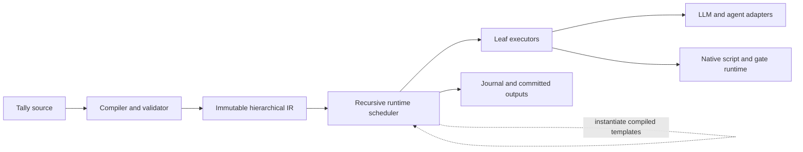

# Tally vNext Canonical Workflow Semantic Model

**Issue:** GitHub #5, “Define the canonical workflow semantic model and vocabulary”

**Status:** Design approved on 2026-08-09

**Goal:** Define the smallest closed semantic model into which every Tally vNext workflow compiles, so later syntax, runtime, adapter, and persistence work share one vocabulary and one set of invariants.

## Product Principle

Tally is a native workflow runner for agentic work. It should express general file processing, multimodal model calls, tool-using agents, scripts, review and revision, sub-workflows, and cleanup without acquiring a domain-specific node for every task.

The language therefore owns orchestration and contracts. Leaf adapters own provider translation. Execution backends own the guarantees of the environment in which work runs. PDF handling, image handling, Docker invocation, BM25 retrieval, skill discovery, and provider-specific tools are capabilities used by leaves, not control-flow primitives.

The model is a clean redesign. It carries no compatibility obligation to the current plan format.

## Decisions

- Compile declarative source into one immutable, typed, hierarchical dataflow IR before execution.
- Preserve hierarchy in the canonical model. Do not flatten scopes into a mutable global DAG.
- Use one dependency relation. An edge may carry typed port bindings or express completion-only ordering.
- Keep control flow closed. Adapters may extend leaf execution, never orchestration semantics.
- Make scope boundaries strict: callers see declared ports, not descendants.
- Treat runtime paths as observation and identity addresses, never as source-level wiring references.
- Use four leaf kinds: `llm`, `agent`, `script`, and `gate`.
- Use five scope kinds: `graph`, `branch`, `map`, `loop`, and `finally`.
- Keep explicit `parallel` and `call` in author-facing syntax, but lower both to ordinary `graph` instances.
- Run independent ready siblings concurrently. Source order has no scheduling meaning.
- Use a first-class `branch` rather than hiding ordinary conditional orchestration in scripts.
- Make dynamic control instantiate compiled child templates. Runtime work cannot invent nodes or edges.
- Use fail-fast propagation and one explicit cleanup construct. Do not add `catch`, compensation, or per-node failure-policy knobs initially.
- Keep transient retry a runtime concern and semantic revision a bounded `loop` concern.
- Keep normal values and files in the same port-and-contract model. There is no separate “artifact passing” control mechanism.

## Chosen Architecture

Three shapes were considered:

1. **Closed hierarchical algebra — chosen.** Structure, runtime identity, replay, cancellation, and traces use the same model.
2. **Generic scopes with configurable policies.** This appears smaller but moves orchestration into an open-ended policy language and creates many low-value knobs.
3. **Flat DAG with coordinator nodes.** This simplifies the base scheduler but makes `map`, `loop`, replay, and cancellation depend on synthetic nodes and runtime graph mutation.

The chosen model is intentionally hierarchical:



Every `graph` declares an input/output contract and contains immediate child nodes, edges, and optionally one `finally` scope. The runtime recursively instantiates and schedules that hierarchy. A nested scope behaves as one contracted node to its parent.

## Domain Vocabulary

### Module

A **module** is a statically resolved reusable workflow declaration with a named input/output signature. The root workflow is also a module.

Modules are a source and compilation concept. Calling a module does not introduce another execution engine; compilation creates a contracted `graph` instance and retains module provenance for diagnostics and traces.

### Graph

A **graph** is an immutable compiled region containing:

- declared input and output ports;
- immediate child nodes;
- edges among its boundary and immediate children;
- source-provenance metadata; and
- optionally one `finally` scope.

A graph is both the fixed hierarchical container and the ordinary scope kind. Root workflows, inline fixed scopes, lowered `parallel` blocks, and lowered module calls all use this same semantic form.

### Node

A **node** is one uniquely named immediate child of a graph. It is either a leaf or a scope. There is no generic plugin-defined node category.

### Leaf

A **leaf** performs one externally observable unit of work:

- `llm` performs one raw model invocation. Its contract can require structured output and raw multimodal attachments.
- `agent` performs one tool-using agent invocation. Workspace files and instructions are invocation inputs, not special graph edges.
- `script` runs a native process under an execution backend.
- `gate` consumes a typed verdict and either succeeds or rejects progress.

Providers implement `llm` and `agent` through adapters. `script` and `gate` are native runtime behaviors. Named agent roles and provider configuration specialize a leaf; they do not create new leaf kinds.

### Scope

A **scope** owns child execution and exposes only its declared ports:

- `graph` contains one fixed child graph.
- `branch` selects exactly one of a closed set of child graphs from a typed boolean or enum value.
- `map` instantiates one compiled child graph for each item in an input collection.
- `loop` instantiates a compiled child graph sequentially for bounded semantic revision.
- `finally` runs a cleanup graph after its parent body reaches any terminal outcome.

The exact port types, collection identity rules, loop bindings, and syntax belong to later tickets. This ticket fixes their place in the algebra.

### Port

A **port** is a named, typed input or output on a leaf, scope, graph, or module. Ports are the only data boundary.

Scalar values, structured values, lists, and files all travel through ports. A file value may later be translated into a raw model attachment or materialized at a stable workspace path, but that adapter/backend behavior does not alter the graph model.

### Edge

An **edge** is the sole dependency relation. It connects nodes and graph boundaries and may carry zero or more typed port bindings:

- an edge carrying bindings transfers committed values and orders the consumer after the producer;
- an edge carrying no bindings means “the source must succeed before the target may start.”

There is no separate `depends_on` scheduler, implicit lexical sequencing, fake `done` value, or second dataflow mechanism.

### Literal

A **literal** is a compile-time value bound directly to an input port. It is not represented as a fake executable node.

### Definition and instance

A compiled **definition** describes immutable structure. A runtime **instance** realizes that definition at a hierarchical path.

Fixed children have stable path segments. `branch`, `map`, and `loop` add recorded runtime discriminators for the selected alternative, item identity, or iteration. The exact durable identity formula is specified with persistence and replay, but hierarchy is a semantic invariant.

## Reference and Encapsulation Rules

References are lexical, local, and compile-time resolvable:

- A graph may bind from its own inputs or the declared outputs of an immediate child.
- A child may receive values only through its declared inputs.
- A graph may expose values only through its declared outputs.
- Child names are unique among siblings; names need not be globally unique.
- A parent cannot reference a grandchild or any other scope internal.
- A module import is static and resolved before execution.
- An agent or script cannot construct a source reference dynamically.

Source references and runtime paths serve different purposes. A source reference such as a sibling output wires data during compilation. A path such as `root/review/items[item-42]/judge` addresses an instantiated node for journals, traces, cancellation, and resume. Workflow source never wires data by runtime path.

Strict boundaries make a scope locally understandable and independently refactorable. They also allow the runtime to commit one contracted result at the scope boundary instead of leaking partial descendants.

## Canonical Scope Semantics

### Graph and automatic concurrency

A graph starts every child whose required inputs exist and whose incoming dependencies have succeeded. Independent ready children run concurrently, subject only to runtime capacity.

The graph succeeds after all required children succeed and all declared graph outputs can be committed. Source order does not add edges.

Author-facing `parallel` creates a clear grouping and join boundary, then lowers to an ordinary graph. Independent ready children may overlap, while declared child-to-child data or completion dependencies delay their consumers exactly as in any other graph. It does not have separate scheduler semantics or failure-policy knobs.

### Branch

A branch:

1. receives a validated boolean or enum selector;
2. chooses exactly one declared alternative;
3. records that choice durably;
4. instantiates only the selected child graph; and
5. exposes the common output contract satisfied by every alternative.

Unselected alternatives never become runtime instances. Ordinary optional work and zero-result paths use `branch`, not failure handling. Tally needs no general expression language to provide this behavior.

### Map

A map receives a collection and instantiates one child graph per stable item identity. Instances are independent and may run concurrently. The map collects their contracted outputs and fails fast when an item instance does not succeed.

Aggregation after a map is ordinary downstream work. Tally does not need a separate `reduce` primitive.

Exact item identity, ordering, and collection output rules are defined with structured control-flow semantics.

### Loop

A loop represents semantic revision, not transient infrastructure retry. It instantiates a compiled child template sequentially, carries declared values between iterations, terminates from a typed decision, and cannot exceed a statically declared bound.

Arbitrary graph cycles are invalid. The bounded loop is the sole initial repetition construct.

### Finally

A graph may attach one `finally` scope. It activates after the graph body reaches success, rejection, failure, or cancellation. It is the sole dependency whose trigger does not require predecessor success.

Cleanup can consume only values available through its declared inputs. It cannot inspect uncommitted partial outputs or reach into failed descendants.

There is initially no `catch`, compensation graph, or branch-on-failure feature.

## Leaf Boundary

The compiler derives each leaf's semantic requirements independently of a particular provider. Examples include structured output, raw attachments with required media fidelity, workspace materialization, and workspace capture. Exact same-node recovery is adapter operational support used automatically when available; it is not a leaf declaration or admission requirement.

The configured adapter and execution backend must satisfy those requirements during preflight. Translation belongs below the language boundary:

- A raw `llm` file input becomes the provider’s supported attachment/content form.
- An `agent` file input is materialized into its workspace at a stable path and described in its invocation manifest.
- A `script` receives declared values and workspace files through the native execution contract.
- Skills are ordinary staged files/instructions or adapter-native configuration, not invocations of a Tally `/skill` primitive.

Session continuation is not cross-node memory. A named agent binding may be reused, but each agent node begins a fresh logical context. Provider recovery references are limited to retrieving, attaching to, or continuing the exact same logical node execution.

## Compilation Responsibilities

Compilation performs all interpretation before paid or side-effecting work begins:

1. Parse the author format.
2. Resolve static local modules and named roles.
3. Resolve every lexical reference.
4. Validate ports, literals, bindings, and scope boundaries.
5. Reject fixed-graph cycles and unbounded repetition.
6. Verify that branch alternatives satisfy one common output contract.
7. Lower `parallel`, `call`, and other conveniences into the closed canonical algebra.
8. Derive each leaf’s semantic capability requirements.
9. Emit immutable hierarchical IR and a source-to-IR provenance map.

Compilation must not depend on executing an agent or script. Any orchestration that cannot be represented in the closed IR is a language-design request, not something an adapter may smuggle into execution.

## Runtime Responsibilities

Before scheduling, runtime preflight validates actual workflow inputs and verifies that configured adapters and execution backends satisfy all compiled capability requirements. Unsupported required capabilities fail before unrelated nodes start.

Execution then:

1. Instantiates the root graph.
2. Starts ready siblings concurrently.
3. Invokes leaves through native executors or adapters.
4. Validates leaf results against their output contracts.
5. Atomically commits accepted outputs at the node boundary.
6. Instantiates only compiled templates selected by structured scopes.
7. Records state transitions, branch choices, dynamic instance discriminators, and committed output references.
8. Propagates cancellation through active descendants.
9. Runs applicable `finally` scopes.

Runtime expansion is constrained instantiation, not arbitrary graph mutation. Internal tool calls made by an agent belong to that one leaf invocation unless the workflow author explicitly models them as Tally nodes.

The runtime remains the sole writer of workflow state. Normal execution, retry, and resume use the same scheduler and node-boundary commit path rather than separate recovery logic.

## Outcomes and Failure Propagation

The semantic model distinguishes four terminal outcomes:

- **Succeeded:** outputs validated and committed.
- **Rejected:** a gate received a valid negative verdict.
- **Failed:** execution, adapter, contract, or runtime failure.
- **Cancelled:** execution was deliberately stopped.

Ordinary edges require predecessor success. On the first non-successful ordinary child, its graph:

1. stops starting new ordinary work;
2. requests best-effort cancellation of running siblings;
3. exposes no uncommitted result;
4. runs its `finally` scope; and
5. publishes its terminal outcome.

If the body succeeds and cleanup fails, the graph fails. If both fail, the body outcome remains primary and the cleanup failure is retained alongside it.

A rejected gate is an expected policy outcome, not an infrastructure failure. A false business condition belongs in `branch`; a gate is used when the workflow must refuse to proceed.

Transient retry repeats the same logical leaf boundary under runtime policy. It does not add graph structure. The exact attempt and idempotency model belongs to the durable identity ticket.

## Lowering and Composition

The closed algebra remains expressive because higher-level patterns compile or compose:

| Author intent | Canonical form |
| --- | --- |
| Static parallel work | `graph` with independent children and a boundary join |
| Sub-workflow call | contracted `graph` instance with module provenance |
| LLM jury | independent `llm` leaves, an aggregation leaf, and `gate` |
| Retrieval/BM25 | `script` or `agent` leaf producing contracted values/files |
| Skills library | file/instruction inputs or adapter-native agent configuration |
| Document or image processing | multimodal `llm`, workspace `agent`, or native `script` |
| Docker or another external tool | invoked by `script`/`agent` under the selected backend |
| Transient retry | runtime policy on the same logical leaf |
| Semantic revision | bounded `loop` |
| Optional work | `branch` |
| Cleanup | `finally` |

This table is not syntax. It states which semantic concepts own each behavior so later designs do not duplicate them.

## Invariants

Every later syntax and implementation decision must preserve these invariants:

1. The compiled IR contains only the closed leaf and scope algebra.
2. Fixed graphs are acyclic; repetition exists only within bounded `loop`.
3. Every source reference resolves lexically to a graph input or immediate child output.
4. Scope internals cannot be addressed externally.
5. Every required input has exactly one source: literal, graph input, or producer output.
6. Every scope exposes exactly its declared output contract.
7. There is one dependency relation; data bindings and completion-only ordering do not create parallel schedulers.
8. Runtime expansion only instantiates compiled templates.
9. Source ordering has no scheduling meaning.
10. Independent ready nodes may run concurrently.
11. A result becomes visible only after validation and atomic node-boundary commit.
12. Failed or rejected work never leaks partial outputs to downstream nodes.
13. Runtime paths identify instances but cannot be used as source references.
14. Adapters and backends cannot add control-flow kinds.
15. Unsupported semantic capabilities fail during preflight before unrelated execution.
16. Normal execution, retry, and resume traverse the same semantic path.

## Conformance Strategy

The canonical model requires behavior tests independent of YAML spelling.

### Structure and references

- Reject unknown node/scope kinds.
- Reject fixed-graph cycles.
- Reject an unresolved, ambiguous, or cross-scope reference.
- Reject duplicate sibling names and multiply bound inputs.
- Reject incompatible branch output contracts.
- Prove `parallel` and `call` lower to ordinary graphs with provenance.

### Scheduling and data visibility

- Prove independent siblings can overlap.
- Prove a completion-only edge orders work without inventing a value.
- Prove source order alone does not order work.
- Prove malformed or failed outputs are never visible downstream.
- Prove a parent exposes only its contracted committed outputs.

### Structured scopes

- Prove `branch` instantiates exactly one alternative and records its choice.
- Prove `map` creates one child instance per stable item identity and collects outputs.
- Prove `loop` cannot exceed its static bound.
- Prove `finally` runs after success, rejection, failure, and cancellation.
- Prove a non-selected branch has no runtime instance.

### Boundaries and propagation

- Prove gate rejection differs from execution failure.
- Prove graph failure is fail-fast and attempts cancellation of active siblings.
- Prove cleanup failure is retained without hiding a primary body failure.
- Prove an adapter cannot register a control-flow kind.
- Prove unsupported attachment, workspace, structured-output, or recovery requirements fail preflight.

### General-workflow fixture

A cross-cutting fixture models the essential Prestige shape without Prestige-specific nodes:

1. accept file and structured inputs;
2. run independent agent analyses;
3. collect contracted results;
4. branch around optional work;
5. judge and gate an outcome;
6. perform bounded revision; and
7. always clean up.

Passing this fixture demonstrates that the semantic algebra can host the motivating workflow while remaining general enough for other agentic workflows.

## Deferred Decisions

This design deliberately does not settle:

- YAML keys or surface spelling;
- the exact scalar, object, list, and file type syntax;
- file storage, manifests, and workspace path spelling;
- map item-key and result-order rules;
- loop port spelling and termination-verdict representation;
- durable node identity, attempt identity, retry limits, and idempotency keys;
- adapter APIs and provider option names;
- script environment, timeout, process, and capture details;
- sub-workflow import and parameter syntax;
- execution-backend isolation policy and implementation.

Those decisions belong to issues #6–#11. They must conform to this model rather than adding alternate dependency, control-flow, or lifecycle mechanisms.

## Explicit Non-Goals

- Backward compatibility with the current Tally plan format.
- A general expression language.
- Plugin-defined orchestration nodes.
- Per-node concurrency, failure, merge, or cleanup policy matrices.
- Automatic workspace merging.
- Cross-node provider chat sessions as agent memory.
- Core BM25 indexing or skill search.
- Docker lifecycle or infrastructure management in the language.
- Security-containment claims from workspace-directory separation alone.
- Human/external signal suspension in the initial algebra.

## Evidence Incorporated

This design incorporates the repository and Prestige/AWF analysis plus two targeted capability investigations:

- `docs/research/tally-adapter-capability-contract.md` established the separation between raw model attachments, workspace materialization/capture, structured results, and same-node recovery.
- `docs/research/tally-native-workspace-isolation.md` established that separate native working directories prevent accidental write overlap but do not imply filesystem, credential, process, network, or hostile-code isolation.

These findings constrain adapter and backend boundaries. They do not enlarge the workflow language.

## Issue #5 Acceptance Mapping

| Required result | Design coverage |
| --- | --- |
| Domain vocabulary | Module through definition/instance sections |
| Canonical node and scope categories | Leaf and scope algebra; canonical scope semantics |
| Dependency rules | Edge model; graph readiness; invariants 5 and 7 |
| Reference rules | Reference and encapsulation rules |
| Compile-time responsibilities | Compilation responsibilities and lowering |
| Runtime responsibilities | Runtime responsibilities and outcomes |
| Preserved invariants | Invariants and conformance strategy |
| No premature YAML choice | Deferred decisions and syntax-independent tests |

## Implementation Evidence

The implemented kernel is recorded in these commits:

- Contract kernel: `f2547eb` and `3e64780`.
- Immutable hierarchical model: `f69160e`.
- Module/call and parallel lowering: `d66de40` and `2263536`.
- Lexical bindings and the sole edge relation: `a00a24a` and `f98ffad`.
- Closed structured-scope validation: `44277c0` and `bb845ac`.
- Canonical immutable encoding: `ca064c2` and `08aed3d`.
- Prestige-shaped structural tracer: `12baebc2e9ea95081e1fb2960fa352768a3cc935` (`test(workflow): prove the canonical semantic structure`).
- Prestige-shaped tracer topology correction: `55a71ec52cb3be9f08d1947ddc6729d3638c9f78` (`test(workflow): correct prestige conformance topology`).

The tracer builds the motivating shape through the public programmatic draft:
file and structured root inputs, a static module call, independent agent
reviewers in a lowered parallel graph, aggregation, exhaustive optional work,
a bounded worker-and-judge revision loop, a deterministic gate, and one
unconditional cleanup graph. It verifies the closed hierarchy and provenance,
the absent reviewer edge, lexical scope encapsulation, declared-output
visibility, source-order equivalence, and rejection of the invalid draft
values the existing surface can represent.

Verification completed with these exact commands:

```bash
go test ./workflow -run 'TestPrestigeShape|TestProductInvariant' -count=1
go test ./value ./workflow -count=1
go test -race ./value ./workflow -count=1
go test ./... -count=1
go vet ./...
git diff --check
if rg -n 'depends_on|continue_on_error|retry_count|attempts|quorum|merge_policy|concurrency:' value workflow; then exit 1; fi
if rg -n 'github\.com/valbaudo/tally/(plan|gate|backend|proc)|tally\.(Backend|Invocation|Result)' value workflow; then exit 1; fi
```

This plan proves compile-time structure only. Issue #6 implements runtime
values and workspaces; #7 implements recursive scheduling and propagation;
#8 implements durable execution; #9 implements adapters; and #10 implements
native scripts. It does not claim runtime scheduling, commit, replay, adapter,
or script conformance.
