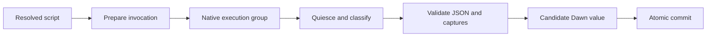

# Native Script Execution Contract

**Issue:** GitHub #10, “Define the native script execution contract”

**Depends on:** GitHub #5 through #9 and their approved specifications

**Status:** Design approved on 2026-08-09

**Goal:** Define the smallest native `script` boundary that can run arbitrary host programs while preserving Dawn's typed values, workspace rules, durable execution truth, cancellation, and honest external-effect semantics.

## Product Principle

A Dawn script is a native command with typed inputs and typed outputs. Everything required to turn that simple promise into a reliable workflow leaf belongs below the author-facing interface.

Scripts may invoke Python, shell utilities, compilers, document converters, OCR tools, browsers, Docker, remote APIs, or any other installed program. Dawn does not model those tools. It owns only the invocation boundary: value delivery, workspace allocation, process lifecycle, diagnostics, validation, capture, and atomic result publication.

This is a clean redesign. It has no compatibility obligation to the current process package, current plan format, Prestige's AWF files, or AWF's code-step contract.

## Decisions

- Use one deep `ScriptExecutor` boundary from materialization through candidate-result construction.
- Make an argument vector the canonical command representation.
- Support multiline shell as source convenience lowered to `[/bin/sh, -c, literal-source]`.
- Never interpolate workflow values into argv or shell source. Scripts read typed input instead.
- Start every script in its one fresh writable workspace; authors do not configure `cwd`.
- Deliver structured input, structured output, and file/tree locations through one versioned process ABI.
- Use fixed `DAWN_INPUT`, `DAWN_OUTPUT`, `DAWN_MANIFEST`, and `DAWN_EFFECT_KEY` environment variables.
- Treat stdout and stderr as diagnostics only. They are never workflow values.
- Close stdin. A tool requiring stdin can receive it through ordinary shell composition.
- Supply a small documented native environment baseline plus explicitly requested external environment names.
- Treat every requested external environment value as sensitive and invocation-local.
- Supply every script a stable logical effect key automatically; do not call it an exactly-once guarantee.
- Allow one optional wall deadline and no default script timeout.
- Own the whole execution group through graceful termination, force-stop, reaping, and pipe drainage.
- Fail a script that exits while same-group descendants remain.
- Use one fixed exit classification. Authors do not configure success codes or retryable exits.
- Never retry scripts automatically.
- On continuation after local process loss, start a new attempt with the same effect key only after the old execution group is known dead.
- Validate structured output and every file/tree capture before publishing one atomic candidate result.
- Keep isolation policy below the workflow language and state every backend guarantee honestly.
- Keep Docker and other persistent services outside Dawn's lifecycle model; scripts operate them as external effects.
- Defer exact author-facing YAML spelling to GitHub #12.

## What This Ticket Does Not Add

This design deliberately adds none of the following:

- a Docker, container, PDF, image, browser, or document node kind;
- a shell-expression dataflow language;
- workflow-value interpolation into commands;
- author-selected working directories, input destinations, or capture paths;
- stdout-as-result or exit-code-as-result modes;
- success-code lists, retryable exit lists, attempt counts, or backoff controls;
- implicit host-environment inheritance or secret literals;
- per-script cancellation grace, idle timeout, CPU, memory, file, or network knobs;
- sandbox, mount, network, permission, Docker, or isolation syntax;
- interactive terminal or PTY orchestration;
- exactly-once claims for external effects;
- PID-based fake process recovery; or
- backward-compatibility fields for current Dawn or AWF.

These cuts do not remove native capability. Shell composition, wrapper programs, installed host tools, detached supervisors, and stronger execution backends remain available without expanding Dawn's language.

## Alternatives Considered

### 1. AWF-shaped shell runner

The workflow could contain shell strings with template interpolation, arbitrary input destinations, arbitrary capture paths, host-environment allowlists, stdout results, configurable exit handling, and generic retries.

This fits Prestige's existing files closely. It also makes shell quoting part of Dawn's type system, exposes filesystem layout as workflow meaning, duplicates typed dataflow through stdout and environment variables, and asks every backend to reproduce a growing collection of path and retry conventions.

### 2. Strict argv-only runner

The language could accept only a direct executable and literal arguments. The runtime boundary would be small, but nearly every nontrivial Prestige script would require a checked-in wrapper file. Ordinary pipelines, redirection, conditionals, and short native setup steps would become ceremony.

This removes useful authoring convenience without reducing runtime complexity: Dawn must supervise the same process and capture the same result either way.

### 3. Manifested native invocation — chosen

Dawn canonicalizes every command to argv, lowers multiline shell source to an ordinary shell argv, and gives the process a fixed typed-value and workspace ABI. The executor hides staging, process groups, diagnostics, validation, capture, and cleanup behind one boundary.

This keeps the author experience small while preserving arbitrary native execution. Prestige's shell-heavy steps remain concise, but AWF-specific interpolation, path mapping, stdout output, and retry policy do not enter Dawn.

## Domain Vocabulary

### Resolved script

A **resolved script** is a canonical executable leaf containing:

- literal argv;
- exact input and output contracts;
- concrete immutable input values;
- workspace seed and publication intent from the universal value model;
- requested external environment names;
- an optional wall deadline; and
- the operator-resolved execution backend and its effective policy.

Aliases, reusable declarations, defaults, and source conveniences are gone before execution. The executor receives one resolved behavior, not configuration layers.

### Script invocation

A **script invocation** is one concrete attempt environment: private workspace, input staging, output staging, process ABI files, environment bindings, execution group, diagnostic streams, effect key, and cancellation context.

It is ephemeral. Only validated output values, execution facts, and commit references become durable.

### Execution group

The **execution group** is the set of local processes the backend owns for one script attempt. The initial local backend uses an operating-system process group. A stronger backend may use a cgroup, job object, container, VM, or remote-job abstraction.

The semantic requirement is quiescence: a script cannot settle while owned execution remains live.

### Diagnostic stream

The **diagnostic stream** carries stdout, stderr, launch details, exit information, and runtime observations. Diagnostics help operators understand execution but never become bindable workflow values or control-flow decisions.

### Candidate result

A **candidate result** is the complete typed output assembled from `DAWN_OUTPUT`, declared file/tree slots, and optional workspace publication. It remains invisible until Dawn validates, stores, and commits the entire value.

### External effect

An **external effect** is any mutation outside Dawn-owned candidate state: API calls, payments, messages, Git pushes, Docker containers, host services, remote jobs, or edits to host files. Dawn supplies a stable effect key that cooperating systems may use for deduplication, but it cannot transact with them.

## Architecture and Ownership



| Owner | Owns | Does not own |
| --- | --- | --- |
| Compiler | Canonical argv, shell lowering, contracts, bindings, declared execution semantics | Shell execution, process groups, host paths, Docker lifecycle |
| Scheduler | Readiness, cancellation propagation, dispatch, structured-scope semantics | Pipe drainage, signal interpretation, file capture, exit-code policy |
| Script executor | Invocation ABI, workspace/staging preparation, environment construction, launch, supervision, classification, candidate assembly | Workflow syntax, graph control flow, durable commit policy |
| Execution backend | Concrete process/job isolation and force-stop mechanism, effective policy evidence | Inventing workflow behavior or silently weakening required semantics |
| Run ledger | Attempts, effect keys, terminal facts, provenance, commits | PIDs as recovery truth, stdout as values, secret bytes |
| Value store | Immutable structured values and file/tree content | Live workspace or external-service state |
| Script | Domain work and explicit external effects | Cross-node visibility, commit, retries, orchestration semantics |

The `ScriptExecutor` is intentionally deep. The scheduler hands it one resolved request and receives one candidate success, typed failure, or cancellation. Process primitives, ABI files, path derivation, and output capture do not leak upward.

## Canonical Command Model

### Argument vector

The runtime command is an ordered, literal argument vector:

```text
["python3", "analyze.py"]
```

The executor resolves `argv[0]` using the effective backend environment and records the resolution as provenance. It does not reinterpret later arguments, split strings, expand variables, apply globbing, or invoke a shell implicitly.

### Multiline shell convenience

The author format may offer a multiline shell body. Compilation lowers it to the same command model:

```text
["/bin/sh", "-c", "<literal shell source>"]
```

The shell source is literal workflow behavior and contributes to the work fingerprint. GitHub #12 owns its YAML spelling and whether a concise single-line form is also offered.

### No command interpolation

Workflow values never become command text through template substitution. This removes quoting and injection semantics from the workflow compiler.

A script needing dynamic values reads `DAWN_INPUT`. A native program can open that file directly; shell source can use `jq`, another parser, or a wrapper program. A command-line tool that accepts only arguments can be called by a small script that converts typed input to its native arguments.

This preserves dynamic execution capability while keeping the value boundary typed.

### Working directory

The direct child's current working directory is always the attempt's private writable workspace. Authors do not configure another `cwd`.

A script can `cd` internally or invoke a program with any host path its backend policy permits. The fixed initial directory prevents reusable modules from depending on author-selected staging layouts.

## Process ABI

Every script invocation receives four fixed variables:

| Name | Meaning |
| --- | --- |
| `DAWN_INPUT` | Absolute path to the canonical typed-input JSON file |
| `DAWN_OUTPUT` | Absolute path where the script must write its typed-output JSON |
| `DAWN_MANIFEST` | Absolute path to the versioned invocation manifest |
| `DAWN_EFFECT_KEY` | Stable logical effect key for this node instance |

`DAWN_INPUT`, `DAWN_OUTPUT`, and `DAWN_MANIFEST` live in a runtime control root outside the publishable workspace. `DAWN_OUTPUT` begins absent. The process must create it even when the contracted result is a scalar, string, or `null`.

No other `DAWN_*` variable is part of the initial public ABI. The workspace is the current directory and is also recorded in the manifest.

### Typed-input JSON

`DAWN_INPUT` preserves the exact contracted input shape. Strings, integers, numbers, booleans, nulls, lists, maps, and objects use their canonical JSON representation.

File and tree leaves use reserved manifest references instead of physical paths:

```json
{
  "document": {"$dawn": "input:/document"},
  "options": {"language": "en"}
}
```

The reserved object is recognized only where the input contract expects a `file` or `tree`. Its value identifies one manifest entry. Ordinary objects do not acquire special meaning merely because they contain a similarly named field.

Every concrete input file/tree has an exact entry, including members of lists and maps. A script resolves the reference through the manifest and then reads the invocation-local path.

### Invocation manifest

The manifest is versioned independently from workflow source. ABI `dawn.script/1` uses this exact envelope:

```json
{
  "abi": "dawn.script/1",
  "workspace": "/runtime/.../workspace",
  "effect_key": "...",
  "inputs": {
    "input:/document": {
      "value_path": "/document",
      "kind": "file",
      "path": "/runtime/.../inputs/document/report.pdf",
      "logical_name": "report.pdf",
      "media_type": "application/pdf",
      "bytes": 12345,
      "digest": "sha256:..."
    }
  },
  "outputs": {
    "output:/report": {
      "value_path": "/report",
      "kind": "file",
      "slot": "/runtime/.../outputs/report"
    },
    "output:/pages/*": {
      "value_path": "/pages/*",
      "kind": "file",
      "namespace": "/runtime/.../outputs/pages"
    }
  }
}
```

Object-key order is insignificant. `value_path` uses JSON Pointer segments; `*` denotes the item position of a dynamic list or map in an output contract. A static output entry has `slot`; a dynamic output entry has `namespace`. A manifest with another ABI identifier is not interpreted as v1. Runtime paths are invocation-local and never become committed values.

For every materialized input the manifest records:

- manifest identity and contracted value path;
- file or tree kind;
- absolute invocation-local path;
- logical filename for files;
- media type for files;
- byte length for files; and
- immutable content digest.

For every statically known file/tree output, the manifest records one exact writable slot directory. A file slot must contain exactly one regular file, preserving that file's logical filename. A tree slot is itself the tree root and may be empty. For a dynamically sized list or map containing file/tree leaves, the manifest records a fixed Dawn-owned namespace root for the corresponding schema position.

### Input staging

Named input file/tree values are materialized beneath a Dawn-owned input root outside the workspace. The optional base tree is materialized into the workspace itself under the universal workspace rules from GitHub #6.

Input staging is presented read-only and is never captured back. On the initial local backend this is a data-lifecycle boundary, not hostile-process isolation: a same-user process may be able to alter its disposable materialization or read other host paths, but it cannot mutate the immutable committed source value, and staged edits never flow downstream.

### Typed-output JSON

The process writes exactly one valid JSON value to `DAWN_OUTPUT`. Dawn parses and canonicalizes it; scripts do not need to reproduce Dawn's canonical byte encoding. The resulting value must match the declared output contract after file/tree references are resolved.

Statically known file/tree leaves reference their exact output-manifest entry:

```json
{
  "summary": "complete",
  "report": {"$dawn": "output:/report"}
}
```

The script writes the file or tree into the manifest-supplied slot directory. A file slot contains exactly one regular file at its root, whose name becomes the output's logical filename. A tree slot is the tree root and may be empty.

For a dynamic list or map of files/trees, the manifest supplies a fixed namespace root for a schema path such as `output:/pages/*`. Each reserved output reference selects a relative member slot beneath that root:

```json
{
  "pages": [
    {"$dawn": "output:/pages/*", "member": "0"},
    {"$dawn": "output:/pages/*", "member": "1"}
  ]
}
```

For a dynamic file, the selected member is a directory containing exactly one regular file. For a dynamic tree, the selected member is the tree root. Dawn normalizes and confines member paths before capture. This supports arbitrary collections without adding workflow capture-path syntax.

The ABI implementation must make static and dynamic references mechanically discoverable and validate them against the contracted value position. Unknown references, unresolved leaves, kind mismatches, escaping paths, and unsupported tree entries fail the candidate.

### Workspace publication

Private workspace files are discarded unless the universal contract explicitly publishes the workspace as a tree. Publication captures the workspace only after successful process quiescence and output validation.

Runtime control, input, and output staging roots live outside the workspace and therefore cannot be duplicated into a published workspace. A script may publish named outputs and its workspace in the same atomic result.

## Environment and Secrets

### Native baseline

The local backend supplies a small documented baseline needed for native tools:

- executable lookup, including `PATH`;
- the effective native `HOME`;
- attempt-local temporary-directory variables;
- locale variables; and
- the fixed Dawn ABI variables.

The exact portable baseline belongs to the backend contract and is recorded by policy version. The initial local backend does not pretend that exposing the user's native home is credential isolation. A stronger backend may provide an isolated home as part of its explicitly recorded policy.

### Requested external environment

A resolved script contains a set of external environment-variable names. The operator supplies their values through runtime configuration. Missing requested names fail preflight before process launch.

All requested values are treated as sensitive and invocation-local, whether they are credentials or ordinary host integration settings. Dawn has one mechanism, not parallel `env` and `secret-env` process protocols.

Secret and environment values are never:

- workflow literals or durable workflow values;
- written into the manifest;
- included in work fingerprints;
- stored in journals or committed results;
- automatically interpolated into commands; or
- eligible as branch, map, loop, or gate data.

The diagnostic pipeline must redact exact injected values before persistence or presentation. This prevents Dawn itself from serializing supplied secrets. It is not a hostile-script exfiltration guarantee: a native process with host authority can deliberately transform or transmit data it can access.

If an account, region, profile, credential version, or external setting is semantically important, the workflow should carry a nonsecret selector or version as ordinary typed input. Secret rotation alone does not change a work fingerprint.

### Child processes

Child processes inherit the constructed environment. A script may convert an environment value into a temporary credential file or another tool-specific form inside its private workspace. Such files remain private unless the script deliberately publishes them; publishing a supplied secret is invalid under GitHub #6's secret boundary.

## Logical Effect Key and External Effects

Every script receives `DAWN_EFFECT_KEY` automatically before it starts. The same value also appears in the manifest.

The key is:

- stable across attempts and `continue` for one logical node instance;
- stable through coordinator restart;
- distinct for intentional duplicate instances;
- new for work actually executed in `fresh` or `derive`; and
- absent from author configuration.

Scripts should forward the key when an external system supports idempotency or deduplication. Examples include API idempotency headers, payment request keys, remote-job labels, Docker labels, and database uniqueness keys.

The key does not make execution exactly once. The external system may ignore it, an interruption may happen after an effect but before Dawn records success, and a later continuation may start a new process attempt. Dawn promises at-least-once execution around uncertain interruption.

Docker containers, host daemons, remote jobs, and other deliberately persistent work are external effects. The script returns their identifiers as structured data when later steps need them, and `finally` performs unconditional cleanup. Dawn does not inspect or manage those systems itself.

## Standard Streams

### Standard input

The executor closes stdin immediately. Dawn never inherits an interactive terminal or lets parallel scripts compete for one input stream.

This does not remove pipe-oriented tools. Shell source can redirect `DAWN_INPUT`, a manifest-resolved file, or generated bytes into a command. A wrapper can do the same for direct argv execution. PTY-requiring tools may be invoked through an installed PTY wrapper; Dawn does not add interactive terminal state to workflow semantics.

### Standard output and error

Stdout and stderr are drained concurrently from process start until the execution group is quiescent. This prevents one full pipe from deadlocking a process while the other is being read.

Both streams are diagnostics only. They are never parsed as results, imported into contracts, or interpreted as workflow control flow. The runtime may stream them live and persist them according to operator-wide diagnostic retention; no per-script log-mode or truncation knob appears in the workflow.

Only `DAWN_OUTPUT` and captured file/tree slots can produce a workflow value.

## Time and Cancellation

### Wall deadline

A script may declare one optional wall deadline. It begins when native execution starts and covers the full period through process quiescence. The deadline contributes to declared execution semantics and work identity.

There is no default per-script duration. A quiet process is not presumed stuck, so there is no idle timeout.

CPU, memory, process-count, disk, and network budgets are backend/operator policy. They are not script-language knobs.

### Cancellation sequence

Cancellation and timeout use the same termination mechanism but produce different semantic outcomes:

1. request graceful termination of the whole owned execution group;
2. wait the run-wide cancellation grace from GitHub #7;
3. force-stop every remaining owned process;
4. reap the direct child and drain both diagnostic pipes; and
5. report the outcome only after execution is quiescent.

External or ancestor cancellation produces `Cancelled`. Expiry of the script's wall deadline produces `Failed(timeout)`.

The cancellation grace is run/operator policy. Scripts do not configure their own grace, signal sequence, or kill policy.

## Process-Group Ownership

### Local execution

The initial local backend creates a fresh operating-system process group for every attempt. Graceful and forced termination target the group, not only the direct child.

The direct child is the exit-status authority, but its exit alone does not establish completion. The backend must also establish that the owned group is quiet and both pipes have reached EOF.

### Descendants after parent exit

If the direct child exits while same-group descendants remain, the executor:

1. terminates the remaining group;
2. reaps and drains what it owns; and
3. returns `Failed(leaked_processes)`.

It does not publish output even if the direct child exited zero. Otherwise Dawn could capture a workspace while hidden processes are still mutating it.

A deliberately persistent service must detach into an external lifecycle domain, close inherited pipes, and return an explicit handle. Docker, systemd, launchd, and purpose-built supervisors already provide such domains. Their cleanup belongs in `finally`.

An intentionally detached process is no longer covered by the local execution-group guarantee. Dawn states that limitation rather than pretending process groups are containment.

### Coordinator loss

The local backend must make coordinator-loss cleanup a tested property. A conforming implementation retains enough runtime-owned attempt identity to establish that an old execution group is dead before a replacement attempt starts. A PID alone is insufficient because PIDs are reusable and diagnostic pipes and process state are lost.

If Dawn loses an uncommitted local invocation:

- the old attempt never publishes a result;
- the backend quiesces or verifies the death of its owned group;
- explicit run continuation may start a new process attempt;
- the logical effect key remains the same; and
- the new process receives a freshly materialized workspace from committed inputs.

This is recovery from interrupted execution, not an automatic retry loop. Exact implementation—such as a runtime-owned supervisor and control channel—belongs to the implementation plan. The semantic conformance requirement is that coordinator loss does not leave Dawn-owned descendants mutating state while a replacement starts.

A future durable execution backend may checkpoint and recover the exact same remote job behind the executor boundary. That capability adds no workflow syntax and does not permit the local backend to fake recovery by PID.

## Exit and Failure Classification

The result classification is fixed:

| Observation | Semantic result |
| --- | --- |
| Direct child exits `0`, group is quiet, output validates and captures | Candidate success |
| Direct child exits nonzero | `Failed(exit)` with code in diagnostics |
| Direct child dies from an unexpected signal | `Failed(signal)` with signal in diagnostics |
| Dawn terminates for external/ancestor cancellation | `Cancelled` |
| Dawn terminates for the optional wall deadline | `Failed(timeout)` |
| Direct child exits while owned descendants remain | `Failed(leaked_processes)` |
| Executable cannot be resolved or launched | `Failed(launch)` |
| `DAWN_OUTPUT` is absent, malformed, or contract-invalid | `Failed(output)` |
| A declared slot is missing, wrong-kind, unsafe, or uncapturable | `Failed(capture)` |

When multiple facts exist, Dawn reports the causal stage that prevented candidate success and retains subordinate details as diagnostics. A nonzero exit does not become success because it happened to write valid output. Cancellation caused by Dawn is not misreported as an unexpected signal.

Scripts normalize tool-specific exit conventions themselves. For example, a shell step using a search tool for which exit `1` means “no matches” can convert that condition into a typed result and exit zero. Dawn does not grow per-tool success-code policy.

## No Script Retry

Dawn never automatically reruns a script because of an exit code, signal, timeout, malformed output, missing capture, or diagnostic text. It does not parse stderr for `429`, “overloaded,” or other provider phrases.

The only automatic retry semantic in Dawn vNext remains GitHub #8 and #9's narrow adapter behavior: a positively recognized transient upstream provider failure may continue the same already-established provider session inside the same attempt. A generic script process is opaque and has no such session contract.

If a workflow wants an agent CLI with same-session transient continuation, it uses the corresponding `agent` adapter. If script code calls a remote service directly, that script owns any service-specific continuation or deduplication behavior.

## Candidate Validation, Capture, and Commit

Candidate construction happens only after the execution group is quiescent and the direct child is eligible for success.

The executor then:

1. reads exactly one JSON value from `DAWN_OUTPUT`;
2. validates its ordinary structure against the output contract;
3. resolves every reserved file/tree reference against the manifest;
4. validates media, kind, path confinement, symlinks, and required slots;
5. captures every declared file/tree and optional published workspace into uncommitted content storage;
6. assembles the one complete Dawn value; and
7. offers that value to the universal atomic commit boundary.

If any step fails, every uncommitted structured value and captured byte is discarded or left unreachable for storage cleanup. No downstream node can observe a partial candidate.

Files elsewhere in the private workspace remain private unless the workspace itself is published. Undeclared output namespaces are ignored as private working state, not captured opportunistically.

## Isolation and Backend Policy

### Initial local guarantee

The first local backend guarantees only:

- fresh workspace allocation per attempt;
- separate runtime control, input, and output roots;
- immutable committed source values;
- disposable input materializations;
- execution-group lifecycle; and
- complete candidate validation before publication.

It does not guarantee:

- filesystem-read or filesystem-write containment outside runtime-owned data;
- credential isolation;
- PID-namespace isolation;
- network isolation;
- hostile-code containment; or
- control over deliberately detached external effects.

Fresh directories prevent accidental workspace sharing. They are not a sandbox.

### Stronger backends

A stronger backend may use Bubblewrap, Landlock, Cloudflare Computer, a container, a VM, a remote job system, or another mechanism. It exposes its effective tested policy to runtime provenance and fails preparation or launch when that policy cannot be established.

No backend silently degrades from a claimed policy to ordinary host execution. Conversely, the workflow language does not acquire sandbox, mount, network, Docker, or permission controls. Backend choice and policy are operator/runtime concerns below the script contract.

## Minimal Author Surface

The script-specific source surface contains only:

- the command, as direct argv or multiline shell convenience;
- requested external environment names; and
- an optional wall deadline.

Everything else is universal Dawn language:

- typed input and output ports;
- file, tree, and media contracts;
- workspace seed and optional publication;
- dependencies and structured control flow; and
- `finally` cleanup.

Everything operational is automatic:

- paths and manifest generation;
- effect key assignment;
- environment construction;
- process-group ownership;
- stdout/stderr drainage;
- cancellation and force-stop;
- exit classification;
- output validation and capture; and
- atomic commit.

GitHub #12 will choose concise YAML spelling that compiles to this model. It may not add alternate result channels, path maps, retry settings, or backend-policy knobs.

## Prestige Coverage

The supplied Prestige pipeline contains 47 AWF `run` steps. Of those, 44 use multiline bodies, 29 use shell operators, 34 write `AWF_OUTPUT`, and 10 contain AWF template interpolation. The largest inspected shell body is approximately 5.4 KB.

The chosen contract covers those behaviors as follows:

| Prestige/AWF behavior | Dawn vNext mapping |
| --- | --- |
| Multiline `run` body | Shell convenience lowered to literal `/bin/sh -c` argv |
| Direct Python or utility process | Canonical direct argv |
| `{{ ... }}` command interpolation | Read typed values from `DAWN_INPUT`; no command templating |
| `AWF_OUTPUT` JSON | Write the contracted value to `DAWN_OUTPUT` |
| `input_files` destination map | Typed file/tree input plus manifest lookup |
| `output_files` capture map | Declared file/tree output plus manifest slot |
| Shared container working tree | One private workspace, optionally seeded from one immutable tree |
| Environment allowlist | Requested external environment names |
| Step timeout | Optional wall deadline |
| Docker Compose and Docker CLI | Ordinary native commands; returned coordinates are structured output |
| Background service lifecycle | Explicit external effect with handle and `finally` cleanup |
| Generic AWF retry | Removed; scripts fail once, agent adapters own narrow same-session continuation |
| stdout/exit implicit values | Diagnostics only; scripts write explicit typed output |

Prestige's deterministic validators, report builders, Docker setup, scoring, consolidation, and cleanup require no additional Dawn node types. Its files and skill directories use the universal file/tree value model. Its provider-backed agent calls use GitHub #9's adapter boundary rather than hiding a provider session inside a generic script.

## Conformance Strategy

### Command and ABI

- Run direct argv without implicit shell interpretation.
- Lower multiline shell to the canonical shell argv.
- Prove workflow values containing shell metacharacters remain data, never command text.
- Verify workspace `cwd` and all four fixed ABI variables.
- Verify stdin reaches EOF immediately.

### Typed values and files

- Round-trip every scalar and structured value, including top-level string and `null`.
- Materialize one PDF, multiple files, nested lists/maps, and trees through manifest references.
- Capture static file/tree slots and dynamically sized file/tree collections.
- Reject missing, escaping, wrong-kind, and malformed references.
- Publish a workspace while excluding runtime-owned control and staging roots.
- Inject failure at every capture stage and observe no partial commit.

### Environment and effects

- Fail preflight for a missing requested environment name.
- Prove requested values never enter manifests, fingerprints, journals, or committed values.
- Redact exact injected values from persisted stdout and stderr.
- Keep one effect key stable across interrupted attempts and `continue`.
- Assign new effect keys to newly executed `fresh` and `derive` instances.

### Streams and lifecycle

- Drain large concurrent stdout and stderr without deadlock.
- Classify exit zero, nonzero exit, unexpected signal, launch failure, timeout, and cancellation distinctly.
- Apply no default wall timeout when none is declared.
- Terminate, force-stop, and reap a descendant tree after cancellation.
- Detect a descendant that outlives a zero-exiting parent and return `Failed(leaked_processes)`.
- Prove output written before a non-success outcome is never published.

### Crash and continuation

- Kill the Dawn coordinator during a running script and prove no owned execution remains before replacement.
- Reconstruct the interrupted attempt without treating a PID as a session.
- Start a continued process as a new attempt with the same effect key and fresh workspace.
- Prove the generic script executor contains no automatic retry loop or provider-error parser.

### Isolation honesty

- Verify the local backend reports only its actual non-isolating policy.
- Reject a stronger backend that cannot establish its claimed policy.
- Prove no silent fallback to ordinary host execution.
- Start and clean a Docker-backed external service using script plus `finally`, with no Docker-specific Dawn branch.

### Prestige-shaped tracer bullet

Translate and execute at least one real chain containing:

1. a shell-based native setup step;
2. a Python validator consuming typed JSON and named files;
3. a report builder producing structured data and a file;
4. a Docker or host service represented by structured coordinates; and
5. unconditional `finally` cleanup.

The chain must run without AWF template interpolation, path maps, stdout results, generic retries, shared writable workspaces, or Docker orchestration syntax.

## Software Design Review

The approved design scores 10/10 against the software-design-philosophy diagnostic:

| Diagnostic | Result |
| --- | --- |
| Each module has one sentence | Pass: the compiler resolves behavior; the executor owns one native invocation; the ledger owns durable truth; the store owns values. |
| Interfaces are simpler than implementations | Pass: one resolved invocation hides staging, environment, processes, streams, validation, capture, and cleanup. |
| Implementations can change behind the boundary | Pass: process groups can become containers, VMs, or remote jobs without changing workflow meaning. |
| Interface intent is documented | Pass: the ABI, outcome rules, ownership, and non-guarantees are explicit independently of Go spelling. |
| Design review is explicit | Pass: AWF-like and strict-argv alternatives and their costs are recorded. |
| Each module hides an important decision | Pass: command lowering, native lifecycle, durable execution, and content identity each have one owner. |
| Boundaries are understandable without implementation reading | Pass: the ownership table and process lifecycle describe the complete semantic handoff. |
| Strategic design investment is present | Pass: current Dawn, AWF, Prestige, workspace isolation, and adapter recovery were inspected before fixing the contract. |

The design reaches depth by exposing only command, named environment requirements, and an optional deadline while implementing the difficult native behavior below that surface.

## Steve Jobs Product Review

**Verdict:** NOT DONE (score 7/10) as a product; the architecture is approved, but the vNext executor and real Prestige-shaped demo do not yet exist.

**The One Thing:** Run any native program as a typed, cancellable, resumable workflow leaf without turning operating-system machinery into workflow syntax.

**Keeps its promise?** The specification does. The current implementation does not yet implement the approved ABI, atomic candidate boundary, or coordinator-loss lifecycle.

**Steps to value:** Three author decisions: choose the command, connect typed ports, and name any required external environment. Timeout is optional; all runtime mechanics are automatic.

**Cut list:** AWF interpolation, arbitrary path maps, configurable cwd, stdout results, success-code lists, generic retry, interactive stdin, Docker syntax, sandbox knobs, process-limit knobs, and exactly-once claims.

**Fix list:** Implement the executor tracer bullet; prove process-group and coordinator-loss behavior; run one real Prestige-shaped chain through JSON, file capture, external service setup, and `finally` cleanup.

**Back of the fence:** Large dual-stream output, malformed JSON, unsafe tree entries, missing slots, secret-bearing diagnostics, leaked descendants, timeout races, and crash-before-commit must meet the same atomicity standard as the happy path.

**Next review:** Unscheduled implementation milestone — the complete tracer bullet and lifecycle conformance suite must be demoable.

## Deferred Decisions

This ticket deliberately leaves the following to their proper owners:

- exact source/YAML spelling for argv, shell convenience, environment-name requirements, and wall deadline — #12;
- exact Go interfaces, packages, process-supervisor mechanism, and allocation strategy — implementation planning;
- diagnostic storage, live presentation, retention, and operator CLI/UI — later observability work;
- exact portable local-environment baseline per supported operating system — backend implementation and conformance;
- physical control-root, staging-root, manifest, and content-store layout — runtime implementation;
- stronger sandbox or remote execution products and their operator policy interfaces — backend implementations; and
- persistent-service APIs, Docker lifecycle, credential stores, and external-effect transactions — external tools and operator infrastructure.

None of these deferred decisions may add alternate dataflow channels, weaken cancellation or atomicity, expose runtime paths as durable values, or silently claim isolation or recovery the backend does not provide.

## Evidence Incorporated

This design uses:

- the approved Dawn vNext semantic, value/workspace, structured-control-flow, durable-execution, and agent-adapter specifications for GitHub #5 through #9;
- current Dawn process launch, process-group cancellation, workspace materialization, and capture code and tests;
- the supplied Prestige pipeline's shell, Python, Docker, environment, output, file, validation, report, and cleanup steps;
- AWF's `CodeStep`, native executor, shell, environment, output, timeout, process-group, idempotency, and retry behavior;
- `docs/research/dawn-native-workspace-isolation.md`; and
- `docs/research/dawn-adapter-capability-contract.md` where script execution meets provider-backed agents.

AWF proves that shell composition, file handoff, timeouts, process-tree cleanup, effect correlation, and durable outputs are necessary. It also shows the complexity cost of template interpolation, arbitrary path maps, stdout-derived results, generic retries, and shared mutable execution environments. The chosen design preserves the capabilities and removes the leakage.

## Issue #10 Acceptance Mapping

| Required result | Design coverage |
| --- | --- |
| Command representation | Canonical literal argv; multiline shell lowered to `/bin/sh -c` |
| Working directory | One fresh writable workspace as fixed `cwd` |
| Scalar input and output | `DAWN_INPUT` carries canonical typed JSON; `DAWN_OUTPUT` accepts one typed JSON value that Dawn validates and canonicalizes, including top-level scalars and `null` |
| Named files | Manifest references, immutable input staging, fixed output slots and dynamic namespaces |
| Environment and secrets | Small baseline, named external requirements, sensitive non-durable values, redaction boundary |
| stdout and stderr | Concurrent diagnostics only; never workflow values |
| Timeouts | One optional wall deadline; no default or idle timeout |
| Process-tree cancellation | Owned execution group, graceful termination, run-wide grace, force-stop, reap, drain |
| Exit classification | Fixed success, exit, signal, timeout, cancellation, launch, output, capture, and leaked-process outcomes |
| Effect-key delivery | Automatic `DAWN_EFFECT_KEY` plus manifest field; stable logical semantics from #8 |
| Capture rules | Quiescence first, complete validation and capture, atomic candidate publication |
| Resume | New local process attempt only after old group death, same effect key, fresh workspace |
| Side-effect honesty | At-least-once semantics; detached services and Docker are explicit external effects |
| Minimal author configuration | Command, named external environment requirements, optional deadline; no operational knobs |
| Generality beyond Prestige | Arbitrary native commands and stronger backends behind one provider-independent executor boundary |

The issue is complete at the design level when this specification is accepted. Implementation planning must turn each conformance item into an executable test before replacing the current process runner.
