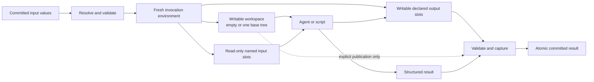

# Dawn vNext Values, Contracts, Workspaces, and Files

**Issue:** GitHub #6, “Define values, contracts, workspaces, and named files”

**Depends on:** GitHub #5 and `2026-08-09-canonical-workflow-semantic-model-design.md`

**Status:** Design approved on 2026-08-09

**Goal:** Define how immutable typed data crosses node and workflow boundaries while filesystem-capable leaves receive one private writable workspace, without exposing host paths, staging machinery, implicit workspace merges, or provider file APIs in Dawn source.

## Product Principle

Mutable filesystems exist only during a leaf invocation. Everything that crosses a Dawn boundary is an immutable contracted value.

This gives Dawn one universal dataflow model for structured results, source trees, PDFs, images, generated reports, skill libraries, and arbitrary collections of files. A raw model may receive a file as an attachment while a tool agent receives the same value at a stable workspace path; that delivery difference belongs below the language boundary.

PDFs, images, office documents, archives, source repositories, and Docker are not workflow node kinds. They are data or tools used by `llm`, `agent`, and `script` leaves.

## Decisions

- `workspace` is an execution role, not a value type.
- `file` and `tree` are immutable value types.
- A filesystem-capable leaf receives exactly one private writable workspace.
- The workspace starts empty or from exactly one immutable base tree.
- All other file/tree inputs are staged under fixed Dawn-owned input slots.
- Declared file/tree outputs use fixed Dawn-owned output slots.
- Authors never choose staging destinations or arbitrary capture paths.
- Full-workspace publication is explicit and produces an immutable tree.
- Parallel branches never share writable workspaces and Dawn never merges their trees.
- Files and trees compose recursively inside objects, lists, and maps.
- Bindings validate but never coerce, project, parse, or convert values.
- File media type is semantic metadata; filename extension is not type authority.
- Raw-LLM attachment fidelity is a consumption requirement checked during preflight.
- Tree capture is portable and deterministic, including empty directories and safe internal symlinks.
- Secrets remain outside the durable value graph and are delivered through operator configuration.
- A node result commits atomically only after structured data and every declared capture validate.

## Alternatives Considered

### 1. Immutable values plus private workspace roles — chosen

Structured values, files, and trees cross boundaries immutably. Each filesystem leaf gets one private writable workspace plus fixed input/output slots. The model supports durable replay, safe parallel branching, raw attachments, named file handoff, and deliberate workspace continuation with no merge policy.

### 2. Workspace-centric flow

Almost all state could live in workspace snapshots. This resembles current Dawn and Prestige's long-lived AWF container, but small outputs repeatedly copy large trees, raw LLM calls need file extraction, and parallel branches create unavoidable merge ambiguity.

### 3. Path-oriented artifacts

Authors could select input destinations and output capture paths as AWF does. This is flexible, but container and host paths leak into contracts, collisions become orchestration concerns, module reuse becomes location-dependent, and every backend must mimic the same arbitrary filesystem layout.

## Architecture

Every resolved leaf invocation has an immutable input value graph and produces an immutable output value graph. Filesystem execution adds one temporary mutable view.



A raw `llm` uses the same contracted input and output values without a filesystem view. Its adapter translates file inputs to provider attachment operations and retrieves any declared file outputs before commit.

The transaction for every leaf is:

1. Resolve already-committed inputs.
2. Validate the input graph against the leaf contract.
3. Verify adapter and backend capabilities.
4. Allocate a fresh invocation environment.
5. Materialize the optional base tree and named inputs.
6. Execute the leaf.
7. Validate structured results and declared file/tree outputs.
8. Optionally capture the workspace.
9. Commit the complete immutable result atomically.

No structured field, file, tree, or workspace snapshot becomes visible before step 9.

## Contract Algebra

Dawn uses a small recursive type algebra:

```text
Type = string
     | integer
     | number
     | boolean
     | null
     | enum(scalar literals)
     | object(named required/optional fields; closed)
     | map<Type>
     | list<Type>
     | file(optional media constraints)
     | tree
     | any
```

### Scalar and structured values

- `integer` and `number` are distinct; integers may widen safely to numbers.
- `null` is a value. It is distinct from an absent optional field.
- Enums constrain scalar literals by both scalar kind and canonical representation and may widen to their scalar base type. Integer `1` does not become number `1`, although integer-to-number widening remains valid.
- Lists are homogeneous and ordered.
- Maps have dynamic string keys and homogeneous values.
- Objects declare named fields and reject undeclared fields by default.
- Optional object fields may be absent; required fields must be present.
- `any` contains ordinary untyped data and is the explicit escape hatch.
- `any` cannot contain an undeclared file or tree handle.

There are initially no arbitrary unions, tuples, intersections, regular-expression constraints, conditional schemas, embedded JSON Schema documents, or implicit nullable forms.

Dawn validates this canonical contract itself at every boundary. An adapter may translate the structured portion into the provider's supported JSON Schema subset to improve generation, but provider enforcement is only assistance: it can never replace or weaken Dawn's final validation.

### Recursive files and trees

`file` and `tree` may appear anywhere another type may appear:

```text
document: file
pages: list<file>
evidence: map<file>
bundle: object {
    report: file
    sources: tree
}
```

This is one value graph, not a structured-output channel plus a separate artifact map. A binding can therefore pass one file, a collection of files, or an object mixing ordinary fields with files and trees while retaining one contract and one commit boundary.

## Values and Storage

All committed values are immutable.

The runtime stores structured data canonically and represents nested files and trees by immutable internal references. Raw file bytes and tree entries live in content-addressed storage. Store addresses are runtime state and never appear as workflow strings.

Content storage may deduplicate identical bytes. The later durable-identity design must still account for metadata that changes execution behavior, including media type, logical filename, and the position of a file within a contracted value.

Host paths exist only while ingesting run inputs or materializing run outputs. Before the root graph starts, Dawn snapshots every supplied file and tree. Later host edits cannot change the run's input values.

## File Values

A file value contains four semantic facts:

- immutable content digest;
- byte length;
- logical filename; and
- media type.

A logical filename is one name, not a destination path. The runtime never treats unchecked user text as a staging path.

### Media type

At ingestion Dawn chooses media type in this order:

1. an explicitly supplied media type;
2. deterministic content sniffing; or
3. `application/octet-stream` as the honest fallback.

Every stored file media value is one canonical concrete type/subtype. Bare tokens, empty type/subtype values, and wildcards are invalid; equivalent case and parameter spelling is canonicalized before storage.

Filename extensions are hints for humans and tools, not media-type authority. A file contract may restrict accepted media using exact types or patterns such as `application/pdf` and `image/*`.

Filesystem output capture is deliberately different from input sniffing: `Outputs.File` requires the file's logical name and concrete media, while `Outputs.Tree` captures a tree with no file metadata. Those arguments are inherent facts of the result, not author-selected host paths or policy knobs. Consequently, a JSON output can remain exactly `application/json` even when its current bytes would sniff differently, and the Dawn-owned physical child named `value` is never reused as its semantic filename.

Media constraints are validated at ingestion, input binding, adapter preflight, and output capture as applicable. Dawn does not silently rename, convert, render, OCR, extract, or parse a file to make it satisfy a contract.

## Tree Values

A tree is a portable deterministic directory snapshot. It preserves:

- relative directory structure;
- empty directories;
- regular-file bytes;
- the executable bit; and
- relative symlinks whose fully resolved target stays inside the tree.

It does not include:

- timestamps;
- ownership or group identifiers;
- extended attributes;
- sockets, devices, or FIFOs;
- absolute symlinks; or
- relative symlinks that escape the tree.

Paths are relative and normalized. Invalid, ambiguous, escaping, or unsupported entries fail capture rather than being silently dropped. A backend that cannot materialize the declared tree exactly fails instead of weakening the value.

This model deliberately improves on the current Git-derived tree channel: empty directories are representable, and a captured absolute symlink cannot silently point a downstream workspace back into the host filesystem.

## Workspace Role

A filesystem-capable `agent` or `script` has one workspace role:

- the runtime allocates one fresh writable directory per invocation or attempt;
- it starts empty unless exactly one input tree is selected as the base;
- materializing a base tree never mutates the committed source tree;
- two nodes never receive the same live writable directory; and
- all private workspace state disappears unless explicitly captured.

`workspace` is not a contract type because mutability is not passed between nodes. Publishing a workspace captures its current contents as a new immutable `tree` value.

### Explicit publication

Whole-workspace capture is never automatic. A filesystem leaf may explicitly declare one output sourced from its workspace. That output is a `tree` value.

A leaf may publish both named outputs and its workspace. Dawn-managed input and output roots are excluded from workspace capture so named inputs and outputs are not duplicated into the tree.

If no workspace publication is declared, caches, temporary downloads, intermediate files, credentials, and other working state are discarded with the invocation environment.

## Invocation Roots and Manifest

A filesystem invocation exposes three logical roots:

- **Workspace:** the one writable working directory.
- **Inputs:** immutable named file/tree values.
- **Outputs:** writable slots for declared file/tree results.

The exact native path and environment spelling belongs to the script and adapter contracts. The semantic rules are fixed here: locations are runtime-owned, deterministic, and not author-configurable.

Dawn supplies a manifest containing, for every materialized value path:

- contract port and nested field/item path;
- kind (`file` or `tree`);
- runtime location;
- logical filename where applicable;
- media type where applicable;
- byte length where applicable; and
- content digest.

The manifest, rather than a guessed path convention, is the adapter's and process's authority. Stable default paths make ordinary prompts and scripts concise; the manifest handles nested and dynamic values without ambiguity.

Input materializations are presented read-only and are never captured back. On the initial local backend this is a data-lifecycle boundary, not a security boundary: a same-user process may bypass filesystem permissions, but it still cannot mutate the content-addressed source value, and edits to its disposable staging copy do not flow downstream.

## Named Slot Derivation

Authors name contract ports, not filesystem destinations.

The runtime derives one collision-free namespace per top-level port. Object fields, map keys, and stable list positions extend that namespace through deterministic safe encoding. User-controlled names are never concatenated unchecked into paths.

- A materialized file value occupies one logical file location beneath its value namespace and preserves its filename in the manifest.
- A materialized tree value occupies one directory beneath its value namespace.
- A declared file output slot must produce exactly one regular file.
- A declared tree output slot contains the tree root and may be empty.
- Composite outputs derive one slot for every nested file/tree leaf.

The invocation-scoped output capability selects one declared semantic path with a kind-specific `File` or `Tree` method; it does not expose a generic capture method or arbitrary source path. File logical name and media are supplied to `File`, while length and digest come from the fixed slot's bytes. Repeated capture of a named tree, or capture of a published workspace, reads through the same pinned root twice and requires identical tree identity before candidate publication. This detects an unstable snapshot; it does not claim isolation from a process that continues mutating the tree.

An agent or script that creates a result at another workspace location copies or moves it into its declared output slot. That visible operation replaces an author-level capture-path language.

Undeclared output namespaces, missing declared slots, collisions, and wrong-kind contents fail the leaf result. Files elsewhere in the workspace remain private unless the workspace itself is published.

## References and Binding

Every workflow, scope, and leaf declares named input and output ports.

A lexical source reference may select:

- a visible sibling output port;
- a statically declared object field beneath that port;
- the current graph's input port; or
- a statically declared object field beneath that graph input.

References do not provide JSONPath, dynamic field lookup, arbitrary list indexing, filesystem paths, or content-addressed store URIs. Dynamic lists and maps are consumed whole or processed through explicit workflow work such as `map`, `script`, `llm`, or `agent`.

### Assignability

Bindings validate but never transform.

- Exact types are assignable recursively.
- `integer` may widen to `number`.
- An enum may widen to its scalar base type.
- Required producer data may satisfy an optional consumer input.
- Any concrete ordinary-data type may bind to `any`.
- `any` may bind to a concrete type only with runtime validation at that boundary.

Closed objects are not implicitly projected. Strings are not parsed as JSON. Values are not stringified. Files are not decoded or converted. Lists are not flattened. Keys are not renamed. If producer and consumer contracts differ, the workflow uses an explicit transformation leaf.

## Parallel Branching and Fan-In

One immutable tree may seed any number of parallel branches. Each branch receives a separate writable materialization and produces independent values.

Given input tree `W`:

```text
W -> branch A -> tree WA + named outputs A
W -> branch B -> tree WB + named outputs B
```

A fan-in consumer may:

- choose no base tree and start empty;
- choose `WA` as its one writable base;
- choose `WB` as its one writable base; and
- receive the other tree and all named results as immutable side inputs.

It may not select both `WA` and `WB` as writable bases. Dawn never chooses a winner, overlays directories, applies diffs, resolves path conflicts, or creates merge commits.

When a real merge is required, an explicit `script` or `agent` receives one base plus the other tree as a named input, performs domain-appropriate reconciliation, and publishes a new tree `WC`. Because all side inputs live in port-derived namespaces, identical filenames from different branches cannot collide during staging.

## Leaf Delivery

### Raw LLM

A raw `llm` has no workspace. The adapter receives structured values and contracted file values directly.

For file inputs:

- images and PDFs require visual-capable delivery by default;
- text media requires text delivery by default; and
- another document input may explicitly require visual preservation.

Fidelity is a consumption requirement, not file metadata. The adapter must preflight each media/fidelity pair. Provider file IDs, uploads, base64, URLs, message parts, cache controls, and temporary provider storage remain adapter-owned.

A text-only conversion cannot satisfy a visual requirement. Unsupported media or insufficient fidelity fails before invocation rather than silently changing what the model sees.

If a raw provider returns declared file outputs, the adapter must retrieve their bytes and metadata into Dawn storage before the node commits. An opaque provider file ID alone is not a durable Dawn result.

### Tool agent

An `agent` receives file/tree values through the invocation roots and manifest. The adapter tells the agent the stable paths or injects the manifest into its instructions. Skills may use the same mechanism as ordinary file/tree inputs, or an adapter may provide native skill support.

A local or remote agent must return all declared outputs to Dawn before commit. Remote container or session state is never a substitute for captured values.

### Native script

A `script` receives the same workspace, inputs, outputs, and manifest contract. Exact environment variable names, standard streams, exit handling, timeouts, and process cancellation belong to the native script execution ticket.

Scripts may invoke Docker, converters, OCR tools, compilers, or any other host tool. Dawn does not manage those tools or add their concepts to the value language.

## Secrets Boundary

Secrets are not durable workflow values in the initial design.

A leaf declares named secret requirements. The operator supplies them through runtime configuration, and the adapter/backend delivers them through its native mechanism, such as environment injection, a temporary file, or provider-managed credentials.

Secret bytes are never:

- stored in content-addressed workflow values;
- written to the journal or trace payloads;
- interpolated into prompts automatically;
- used as branch, map, loop, or gate data;
- exported as workflow outputs; or
- included as plaintext in cache identity.

Prestige's Adyen and provider credentials therefore become execution configuration for the leaves that need them, while repository URLs, findings, reports, and files remain normal dataflow values.

Dawn does not initially support a leaf producing a durable secret value for another leaf. If demonstrated workflows require that capability, it needs a separately designed opaque secret-reference and secret-store contract rather than relaxing ordinary values.

## Validation and Failure Semantics

### Compile-time and preflight failures

The workflow is rejected before unrelated execution for:

- unknown or malformed types;
- duplicate ports or invalid optionality;
- incompatible bindings;
- unresolved or cross-scope references;
- more than one workspace base;
- a tree value at any depth bound to a raw-LLM input;
- unsupported media/fidelity requirements;
- missing run-supplied file, tree, or secret inputs;
- a backend unable to materialize or capture a declared kind; or
- a remote adapter lacking required enumerate/download capability.

### Ingestion and materialization failures

Input preparation fails for:

- a missing or unreadable host source;
- media mismatch;
- an invalid tree path;
- an absolute or escaping symlink;
- a special filesystem entry;
- a path collision after portable normalization; or
- a backend unable to reproduce the committed value exactly.

No leaf starts with a partial input environment.

### Result-validation failures

A leaf result commits nothing when:

- structured output violates its contract;
- a declared slot is missing;
- a slot has the wrong file/tree kind;
- a file slot does not contain exactly one regular file;
- output media violates its contract;
- a tree contains an unsafe or unsupported entry;
- an undeclared output namespace appears;
- workspace publication cannot be captured exactly; or
- a remote adapter cannot retrieve the complete declared result.

Missing or corrupt already-committed content is a runtime integrity failure, not an ordinary leaf outcome. Retry classification, attempt identity, and repair semantics belong to the durable identity and control-flow tickets.

## Defaults and Deliberate Absences

The simplest viable defaults are:

- empty workspace unless one base tree is selected;
- no workspace publication unless declared;
- immutable named side inputs;
- one derived input/output namespace per port;
- run-input media inferred deterministically when not supplied; filesystem file outputs supply concrete semantic media at capture;
- PDFs and images require visual raw-LLM delivery;
- no workspace merge;
- no implicit file conversion; and
- no secret values in the graph.

There are no author knobs for staging destination, capture source path, workspace directory, mount layout, merge policy, copy strategy, content-store URI, provider file ID, local isolation mode, or automatic archive behavior.

## Prestige Translation Proof

The current Prestige AWF workflows rely heavily on a long-lived container and shared `/tmp/prestige-codex` paths. Dawn vNext makes those dependencies explicit:

1. The clone/recon phase publishes the repository as a source tree and reconnaissance as structured output.
2. Static analysis and dynamic setup receive private source-tree workspaces. They do not share a live directory.
3. Dynamic setup publishes structured target/service coordinates. Host services or Docker started by its script remain external execution effects, not workspace data.
4. Static analysis publishes findings as structured values and named files.
5. Validation receives findings and target data through contracted ports.
6. Scoring and remediation run in parallel, publishing independently named result files and any intentionally continued source trees.
7. The report node receives scored findings, validation statistics, and remediation results through isolated named ports. It needs no `/tmp` destination mapping.
8. Cleanup uses the later `finally` semantics and structured service identifiers; Dawn does not manage Docker lifecycle itself.

The pipeline's existing `scored-findings.json`, `validation-stats.json`, `remediation.json`, and final report naturally become named file values. Validator and skill directories become named tree inputs. The repository follows explicit base-tree selection and publication rather than ambient shared-container state.

At the main fan-in, identical filenames from different branches remain isolated by their port paths. If remediation and another branch both modify source trees, a deliberate merge leaf chooses the reconciliation rule. Dawn supplies no hidden filesystem winner.

## Ownership Boundary

| Owner | Owns | Does not own |
| --- | --- | --- |
| Language | Type algebra, ports, references, media constraints, attachment fidelity requirements, workspace seed/publication intent, declared file/tree outputs | Host paths, provider IDs, upload mechanisms, native directory paths, storage URIs |
| Runtime | Canonical values, content-addressed storage, ingestion, slot derivation, manifests, staging, validation, capture, atomic commit | Provider conversion semantics, agent tools, Docker lifecycle, secret storage |
| Adapter/backend | Capability declaration, provider attachment translation, workspace allocation, process launch, remote upload/download, native secret delivery | Altering contracts, weakening fidelity, inventing paths, committing incomplete results |
| Leaf work | Domain transformations, copying results into output slots, explicit tree merges, document conversion, tool execution | Durable identity, cross-node state, implicit output publication |

## Conformance Strategy

The tests are semantic and independent of YAML spelling.

### Type and value tests

- Round-trip every scalar and structured type canonically.
- Round-trip nested file/tree values inside objects, lists, and maps.
- Prove optional and `null` remain distinct.
- Prove integer and enum widening and reject every implicit coercion.
- Prove `any` cannot carry undeclared binary handles.
- Prove host edits after ingestion do not change a run input.

### File and tree tests

- Preserve file bytes, logical filename, media type, and byte length.
- Use explicit media, deterministic sniffing, and octet-stream fallback in the specified order.
- Preserve empty directories, executable bits, and safe internal symlinks.
- Reject absolute/escaping symlinks, special files, invalid paths, and portable path collisions.
- Materialize, capture, store, and rematerialize byte-identical values across resume.

### Workspace and slot tests

- Give parallel consumers independent workspaces from one base tree.
- Prove neither branch mutates the committed source tree.
- Derive collision-free paths for nested objects, lists, maps, and adversarial names.
- Reject missing, extra, wrong-kind, and colliding outputs.
- Exclude Dawn input/output roots from workspace publication.
- Discard private workspace state when publication is absent.
- Fan in two branches with one base tree and the other branch's results as named inputs.
- Require an explicit leaf to merge two produced trees.

### Adapter tests

- Deliver one PDF or many files to a raw LLM as attachments, never as a workspace.
- Deliver the same files to an agent/script through slots and a manifest.
- Reject a text-only PDF/image path when visual fidelity is required.
- Reject unsupported media before dispatch.
- Require remote outputs to be downloaded before commit.
- Prove a provider file ID alone cannot satisfy a committed file result.

### Atomicity and secrets tests

- Inject failure at every validation and capture boundary and observe no partial result.
- Resume a consumer from committed file/tree refs after the producer environment is gone.
- Prove missing/corrupt committed content halts as an integrity failure.
- Prove secret bytes never appear in manifests, journals, traces, committed values, outputs, or cache records.

### Prestige-shaped fixture

The fixture passes named static-analysis, validation, scoring, and remediation files into a final report leaf while source trees branch and rejoin explicitly. It runs without author-selected destinations, automatic merges, or shared writable directories and produces the same committed result after interruption and resume.

## Deferred Decisions

This design deliberately leaves the following to later tickets:

- exact YAML spelling for types, ports, workspace seed/publication, and media constraints;
- concrete native input/output root and manifest path names;
- list item identity and dynamic map scheduling semantics;
- branch, map, loop, gate, cancellation, and cleanup propagation;
- content-reference encoding, node identity, cache keys, attempt records, retry, and replay;
- adapter capability API and provider configuration;
- script environment variables, standard streams, process limits, and cancellation;
- sub-workflow import syntax and file/tree port forwarding; and
- host output-materialization CLI syntax.

Later designs may choose syntax and implementation but may not add a second artifact channel, mutable cross-node filesystem, author destination paths, automatic tree merge, or silent media conversion.

## Explicit Non-Goals

- Backward compatibility with current Dawn `workspace` field behavior.
- AWF-compatible `input_files` destination maps or `output_files` capture paths.
- Full JSON Schema as Dawn's type language.
- A document-specific node catalog.
- Automatic OCR, parsing, rendering, archiving, extraction, or conversion.
- Persisting raw provider file IDs as durable results.
- Treating read-only staging as hostile-code containment.
- Automatic workspace diff application or merge.
- Managing Docker, containers, or services as workflow data.
- Acting as a secrets manager.

## Evidence Incorporated

This design uses:

- the Prestige/AWF workflow files under the supplied `pipeline/` directory;
- AWF's named `input_files`/`output_files` artifact channel and cross-container resume tests;
- current Dawn's content-addressed workspace materialization/capture behavior;
- `docs/research/dawn-adapter-capability-contract.md`; and
- `docs/research/dawn-native-workspace-isolation.md`.

AWF demonstrates the need for durable named file handoff and capture-before-commit. Its author-selected destination paths and shared long-lived containers are deliberately not copied. Current Dawn demonstrates immutable tree branching but not independent named files, portable empty directories, or safe absolute-symlink handling.

## Issue #6 Acceptance Mapping

| Required result | Design coverage |
| --- | --- |
| Author-visible types and references | Contract algebra; references and binding |
| Ownership and mutability | Values and storage; workspace role; ownership boundary |
| Workspace branching | Workspace role; parallel branching and fan-in |
| Named side-input files | Invocation roots; named slot derivation |
| File selection and capture | Explicit output slots; explicit workspace publication |
| Media-type handling | File values; raw-LLM delivery |
| Adapter delivery | Leaf delivery and ownership boundary |
| Validation failures | Validation and failure semantics |
| Simplest viable defaults | Defaults and deliberate absences |
| Parallel fan-in without destination knobs | Parallel branching and fan-in; Prestige proof |

## Implementation Evidence

The reviewed Task 1–7 implementation history is:

- Task 1: `94eff2572ca866632c480763bd64789a291b4453` — `feat(content): store immutable bytes by typed digest`
- Task 1 reviewed fix: `6ce6b5a278a384d88f5406ffa52e513b9f00c1d7` — `fix(content): honor cancellation before publication`
- Task 2: `c25bb482477225376feacbdb87ec82b3b086b96f` — `feat(value): model immutable runtime values`
- Task 2 reviewed fix: `eba34ad4b94133dbf2799c4d114c307a5aa7bdc5` — `fix(value): make validation preflight iterative`
- Task 3: `1668006cb347055780e2cdd9d18db85679b67fec` — `feat(content): ingest immutable file values`
- Task 3 reviewed fix: `1c857f76c44f5aafa8764c4b0639c19cd1e60be6` — `fix(content): publish files without overwrite races`
- Task 3 reviewed fix: `3eb00b8c6bb9530f68d17a1a169644d192647841` — `fix(content): tolerate transient empty file reads`
- Task 4: `ad110d6ce1f8f06ef56009c8f9d59953878053ae` — `feat(content): capture portable immutable trees`
- Task 4 reviewed fix: `535fe4bdb5a5b9e905f526373f974e9ad95be436` — `fix(content): confine portable tree backends`
- Task 4 reviewed fix: `e6b19cd7287e6229fb456c0a78db5566c5089939` — `fix(content): bind materialized tree identities`
- Task 4 reviewed fix: `b0dc262c9fd5577a9de5d95ee725c243a61ba547` — `fix(content): roll back on final close failure`
- Task 5: `e79eb8f080f67325486040811a10c3c15a53e19e` — `feat(workflow): declare file delivery semantics`
- Task 5 reviewed fix: `b03ebbb5d0aca1da952462bb4712f2da620253ed` — `fix(workflow): traverse delivery types iteratively`
- Task 6: `a6dc281ce72d4edccd6730607d5ab88f918dfb45` — `feat(workspace): prepare private invocation roots`
- Task 6 reviewed fix: `6b435591e3ee05a3b102974ee21522c33070166b` — `fix(workspace): confine dynamic slots and retry cleanup`
- Task 6 reviewed fix: `30b497c45d9506bde5ea99b63f3282e79aeeacc2` — `fix(workspace): guard invocation root cleanup`
- Task 6 reviewed fix: `ca87947ed44504ed68ec06b574ffdc7fcacec908` — `fix(workspace): remove invocation roots safely`
- Task 7: `dc41ece9a8646af7b5633b7631fdfda71f3e3b0e` — `feat(workspace): capture one complete candidate`
- Task 7 reviewed fix: `863388e786705675384d5d06988df3fe54c8e53a` — `fix(workspace): bind capture provenance and roots`
- Final traversal review fix: `475e3c47d22cddea35d9b7f2d9cb12e1d6f23213` — `Make public finite traversals stack safe`
- Final value/capture review fix: `a1e53243bc9da1586df2bd4e1b404e6cd93ea327` — `Fix value and capture boundary semantics`

The syntax-independent Prestige-shaped tracer's first execution was already green, so Task 8 required no integration fix:

```text
go test ./workspace -run 'TestPrestigeValueFlow|TestProductInvariant' -count=1
ok   github.com/valbaudo/dawn/workspace 1.107s
```

Verification commands:

```bash
go test ./content ./value ./workflow ./workspace -count=1
go test -race ./content ./value ./workflow ./workspace -count=1
go test ./... -count=1
go vet ./...
git diff --check
if rg -n 'github\.com/valbaudo/dawn/(store|plan|gate|backend|proc)|dawn\.(Ref|Backend|Invocation|Result)' content value workflow workspace; then exit 1; fi
if rg -n 'KindWorkspace|artifact(s)?\s+map|input_files|output_files|capture_path|destination_path|merge_policy|provider_file_id|workspace_dir|mounts:' content value workflow workspace; then exit 1; fi
```

Every verification command exited zero; both invariant scans produced no matches.

> This implementation provides immutable values/content and local workspace preparation/candidate capture. GitHub #7 owns structured scheduling and propagation; #8 owns durable commits, replay, and reuse; #9 owns adapter preparation/run/recovery; #10 owns the native script ABI and process lifecycle; #11 owns sub-workflow linking; #12 owns author syntax.
